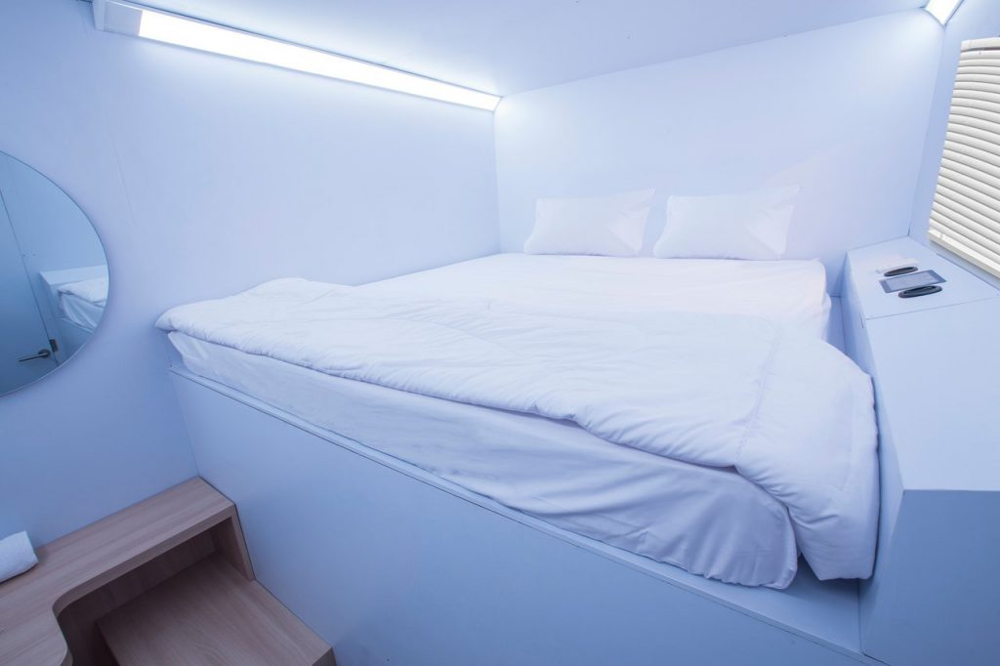
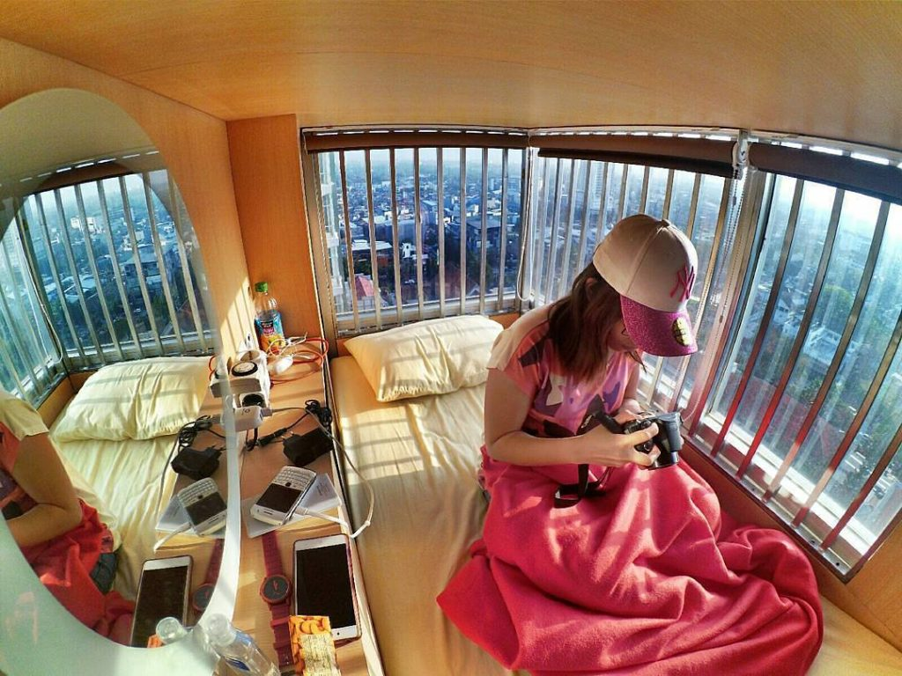
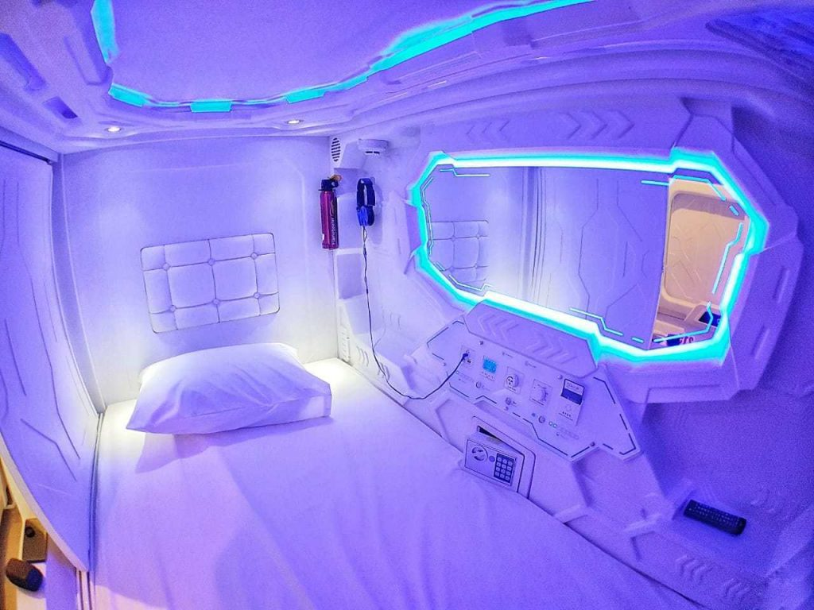
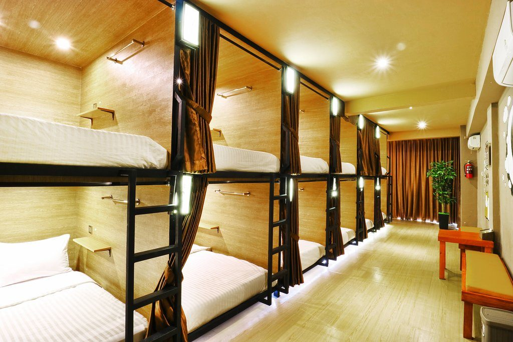

Hari liburan menjadi salah satu waktu yang bisa menjadikan kita untuk refreshing di tempat-tempat nyaman. Apalagi tempat penginapan seperti hotel ini biasanya digunakan oleh orang-orang yang berasal dari jauh bertujuan liburan di kota tetangga. Tahukah kamu ada sebuah hotel jenis kapsul di Bandung?

Hotel jenis kapsul di Bandung, merupakan salah satu tempat penginapan dari beberapa kalangan, karena harga yang tertarif disana mulai dari Rp. 60.000-100.000 per malam.

Banyak sekali hotel jenis kapsul di Bandung lumayan banyak sekali yang bisa menjadi tempat ter-istimewa buat kamu.

Nah, pada kesempatan kali ini saya kan mengulas beberapa hotel jenis kapsul yang ada di Bandung Jawa Barat ini. Walaupun banyak sekali hotel jenis kapsul yang ada disana.

Namun di artikel ini kamu akan menemukan hotel jenis kapsul yang murah tetapi tidak murahan. Ada sekitar 5 hotel jenis kapsul yang saya rekomendasikan pada pembahasan dibawah ini !

5 Review Hotel Jenis Kapsul Murah di Bandung Jawa Barat

Sebelum mengenalkan hotel kapsul ini, tahukah kamu apa itu hotel kapsul? Berdasarkan wikipedia menyebutkan bahwa Hotel Kapsul merupakan sejenis hotel yang awalnya dikembangkan di negeri sakura yaitu Jepang.

Adapun ciri yang dimiliki oleh hotel ini diantaranya mempunyai banyak ruangan kamar namun berukuran kecil dan oleh karena itu dinamakan dengan hotel kapsul. Ciri lainnya yaitu mempunyai fasilitas standar dan pelayanan seperti hotel konvensional dengan tarif yang relatif murah per malamnya.

Salah satu fungsi dari hotel ini hampir sama dengan hostel yakni penginapan kecil dengan harga murah. Nah, buat kamu yang lagi ke Bandung nih bisa mampir menginap di Hotel Kapsul yang saya rekomendasikan untuk kamu.

Berikut 5 hotel kapsul yang ada di Bandung dengan harga relatif murah !

## 1. Bobobox Pods Paskal

*Sumber Foto: Tripadvisor[^1]*

[^1]: [Hotel feature Bobobox Pods Paskal](https://www.tripadvisor.com/Hotel_Feature-g297704-d14789748-zft1-Bobobox_Pods_Paskal.html).

Hotel pertama yaitu Bobobox Pods Paskal merupakan salah satu hotel yang saya rekomendasikan untuk kamu saat berkunjung di Bandung.

Hotel satu ini terdiri dari 3 lantai dan 2 desain eksterior diantarnaya tipe sky dan earth. Fasilitas hote ini yaitu king size bed, bantal, AC, sandal, selimut, speaker, bluetooth dan masih banyak lagi.

## 2. Inap at Capsule Hostel

*Sumber Foto:  Inapatcapsule[^2]*

[^2]: [https://www.instagram.com/inapatcapsule/](https://www.instagram.com/inapatcapsule/)

Penginapan ini mempunyai kapasitas untuk 1 orang saja, karena kamarnya mempunyai ukuran yang bisa dibilang kecil. Namun penginapan ini dilengkapi dengan TV, kabin untuk tempat barang, free WiFi, dan kopi, AC, dan seperti fasilitas misalnya mini library dan dapur.

Ada satu kamar yang spesial buat memanjakan kamu dengan view kota Bandung di atas ketinggian.

## 3. Shakti Capsule

*Sumber Foto: Hotelpedia[^3]*

[^3]: [https://hotelopedia.id](https://hotelopedia.id/)

Shakti Capsule merupakan salah satu yang menjadi jaringan dari Shakti Hotel Grup yang ada di Bandung, Jawa Barat. Hotel Kapsul ini tepatnya terletak di Jl. Cihampelas No. 119 Bandung, Jawa Barat.

Yang paling menarik pada hotel ini dibandingkan yang lain yaitu pada desain yang mengedepankan futuristik menjadi terlihat modern, unik dan masih banyak lagi. Kamar hotel ini mempunyai panjang kurang lebih 180cm.

## 4. VK Pods Paskal

*Sumber Foto: Tripadvisor[^4]*

[^4]: [Review VK Pods Bandung](https://www.tripadvisor.com/Hotel_Review-g297704-d14120592-Reviews-VK_Pods_Bandung-Bandung_West_Java_Java.html)

Fasilitas yang ada di hotel yang dapat kamu dapatkan diantaranya WiFi gratis, check-in check-out ekspres, dapur, penitipan barang, resepsionis 24 jam, dan masih banyak lagi. Pasalnya hotel ini dibangun dengan 3 lantai dengan mempunyai 20 unit kamar.

Itulah diatas rekomendasi hotel kapsul yang ada di Bandung dengan harga relatif murah. Jadi, buat kamu yang lagi berkunjung ke Bandung bersempatkanlah menginap di hotel diatas.

Semoga bermanfaat dan terinspirasi dengan artikel kami.
