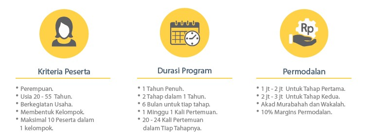
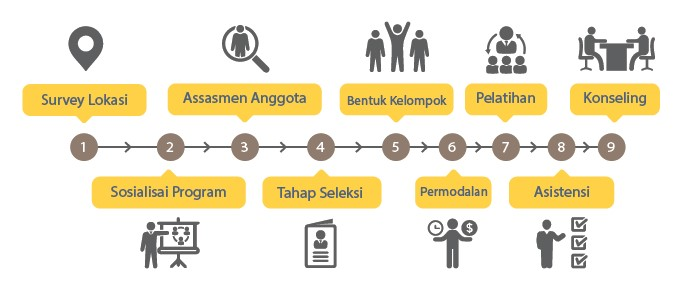
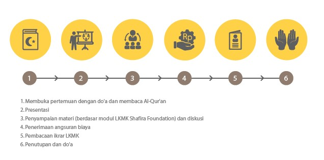
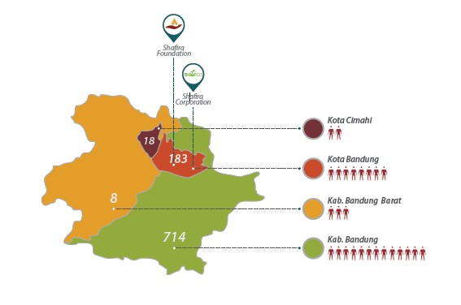
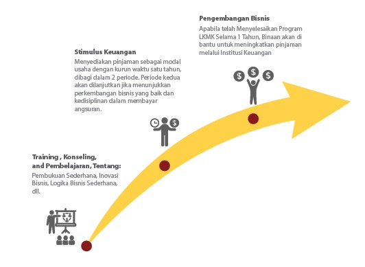

Corporate Social Responsibility (CSR) dapat dibilang politik etis bagi sebuah perusahaan bagi para pemangku kepetingan seperti konsumen, karyawan, pemegang saham, dan lingkungan.

Diharapkan dapat berkontribusi pada pembangunan berkelanjutan yang tidak hanya memikirkan aspek ekonomi seperti tingkat keuntungan.

Tetapi juga memperhitungkan dampak sosial serta lingkungan yang timbul dari setiap kebijakan perusahaan.

Sekilas pandangan singkat pribadi tentang apa itu CSR, kali ini untuk penugasan mata kuliah etika profesi yang tugasnya adalah mencari program kerja CSR.

Kebetulan tempat bekerja saya telah memiliki lembaga yang terkait dalam penyaluran dana CSR, yakni Shafira Foundation.

Untungnya karena departemen tempat saya bekerja memiliki koneksi orang dalam hasil dari membantu mereka dalam pengembangan websitenya.

Jadi saya memiliki sedikit data untuk menuntaskan tugas ini dan juga secara tidak langsung mengetahui program mereka yang sudah berjalan lalu pandangan mereka ke depannya.

## Sejarah

Pada tahun 2002 [Shafira Corporate](http://shafira.com) telah mengadakan kegiatan sosial bernama Shafira Peduli Anak yang dikelola oleh bagian Human Resource Departemen dan Marketing Commnucation berupa pemberian beasiswa terhadap anak yatim dan dhuafa.

Karena hasil evaluasi menunjukkan program ini kurang tepat dalam menghadapi permasalahan yang lebih kompleks.

Maka pada tahun 2006 kegiatan Shafira Peduli Anak digerakkan oleh tim khusus yang bergerak dalam pengembangan sosial juga berganti nama menjadi Amal Foundation.

Pada tahun 2012 Amal Foundation berubah nama menjadi Shafira Foundation.

Oke jadi saya tertarik dengan program pemberdayaan ibu-ibu kelompok prasejahtera atau menengah ke bawah dalam mengembangkan bisnis untuk mempertahankan bahkan memperkuat nafkah bagi keluarga.

Karena diharapkan efek domino positif pun akan bergulir seperti sang anak dapat melanjutkan pendidikannya, bahkan tak jarang dapat menjadi pelopor ekonomi bagi warga sekitarnya.

Dinamai dengan "Program LKMK (Lembaga Keuangan Mikro Kewirausahaan) Shafira Foundation" yang bertujuan untuk memberdayakan masyarakat untuk menjadi lebih baik.

Prinsipnya adalah membuat orang dan mendorong masyarakat untuk mampu mencapai impian mereka dan terbebas dari batasan- lain menjadi lebih mandiri, mengembangkan mental yang kokoh, serta merubah perilaku menjadi lebih baik.

Program ini didedikasikan kepada para ibu yang mempunyai usaha mikro yang dibentuk dalam bentuk kelompok.

Jadi diharapkan dalam kelompok ini para ibu dapat saling bercerita, berbagi, dan belajar bersama-sama untuk tetap bersemangat.

Lalu para konselor selain memberikan bantuan modal juga akan mendampingi para ibu untuk memberikan pendekatan secara psikologis untuk mengembangkan penguatan mental melalui pengajian, diskusi ringan mengenai masalah yang mereka hadapi.

Sehingga diharapkan membuka wawasan mereka mengenai pengembangan usaha mereka sendiri.

Setiap minggunya para konselor akan memberikan materi yang praktis, singkat, dan mudah diterapkan dalam kehidupan sehari-hari.

Seperti menanamkan perilaku menabung, motivasi, perhitungan ekonomi sederhana, promosi, branding, dan lain sebagainya.

## Syarat & Ketentuan Program

Syarat yang diberlakukan dalam program ini yaitu usia bagi para calon binaan, yaitu rentang usia 20-55 tahun, dengan anggota dalam satu kelompok yaitu maksimal 10 orang.

Selanjutnya, periode pelaksanaan program ini selama satu tahun dengan 2 kali periode, satu periode selama 6 bulan. Diadakan pertemuan satu kali dalam seminggu.

Yang terakhir yaitu pinjaman modal yang diberikan pada periode pertama sebesar Rp. 1.000.000 sedangkan untuk periode kedua sebesar Rp. 3.000.000.

### Proses Pembentukan Kelompok Binaan

### Proses Kegiatan Pendampingan Mitra Binaan

### Bagan Penyebaran Jumlah Anggota Mitra Binaan

### Gambaran Pembiayaan

