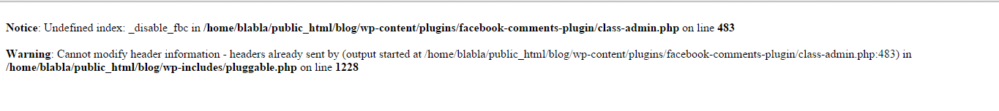

Ceritanya sedang mendekor sebuah blog baru untuk sebuah situs E-Commerce yang kita sebut saja [Zoya Plaza](http://www.zoyaplaza.com).

Lalu saya ingin mengganti fitur komentar yang ada dengan fitur komentar Facebook, setelah mencari akhirnya saya mendapatkan sebuah plugin yang dibuat oleh [Alex Moss.](https://profiles.wordpress.org/alexmoss/)

Plugin itu bernama [Facebook Comments](https://wordpress.org/plugins/facebook-comments-plugin/). Singkat kata proses instalasi serta memasukkan App ID telah di lalui hingga tiba-tiba ada suatu notifikasi error pada saat mengedit atau membuat artikel baru yakni,

Setelah googling sekitar 10 menit untuk mencari permasalahan yang sama dan mungkin permasalahan ini telah terselesaikan.

Namun ternyata kasus ini telah dilaporkan oleh 1 orang sekitar seminggu sebelumnya dan belum ada penyelesaian dari [Alex Moss](https://profiles.wordpress.org/alexmoss/).

Mencoba untuk menyelesaikannya selama 15 menit tentunya dengan bantuan Om Gog, namun ternyata sia-sia. Karena khawatir akan memakan waktu lebih lama lagi akhirnya saya pun meminta bantuan kepada seorang teman yang memang keahliannya tak perlu diragukan lagi.

Ternyata dia hanya membutuhkan waktu kurang dari 1 menit untuk menyelesaikan masalah ini :D

Menurutnya permasalahan itu terjadi karena ada parameter yang belum terinisialisasi, tapi maafkan jika salah sebut yah :)

Nah coba deh kalian main-main ke situs teman saya yang suka disebut Mang Daeng oleh teman-teman sekantor, karena usianya yang tak muda lagi _\*peacemang_ nama situsnya juga unik nih [NyingSpot](http://www.nyingspot.com)

Ngomong - ngomong ini hasil kodingnya,


function fbc_save_postdata( $post_id ) {
    if ( defined( 'DOING_AUTOSAVE' ) && DOING_AUTOSAVE ){
        return;
    }
    if ( !isset( $_POST['fbc_noncename'] ) ) {
        return;
    }
    if ( isset( $_POST['fbc_noncename'] ) && !wp_verify_nonce( $_POST['fbc_noncename'], plugin_basename( __FILE__ ) ) ){
        return;
    }
    if ( 'page' == $_POST['post_type'] ){
        if ( !current_user_can( 'edit_page', $post_id ) ){
            return;
        }
    } else {
 
        if ( !current_user_can( 'edit_post', $post_id ) ){
            return;
        }
    }
        $_disable_fbc_data = false;
        if(isset($_POST['_disable_fbc'])) 
            $_disable_fbc_data = sanitize_text_field( $_POST['_disable_fbc'] );
    add_post_meta($post_id, '_disable_fbc', $_disable_fbc_data, true) or
    update_post_meta($post_id, '_disable_fbc', $_disable_fbc_data);
 
}
add_action( 'save_post', 'fbc_save_postdata' );
