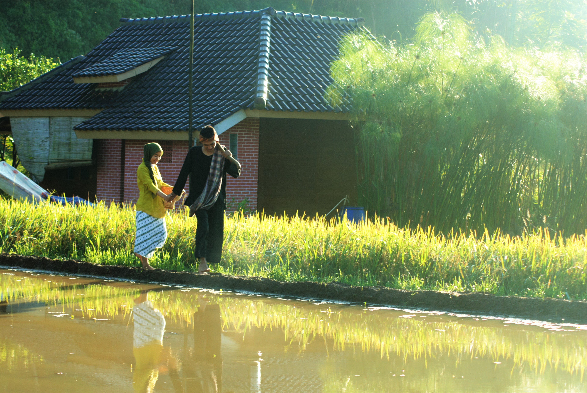
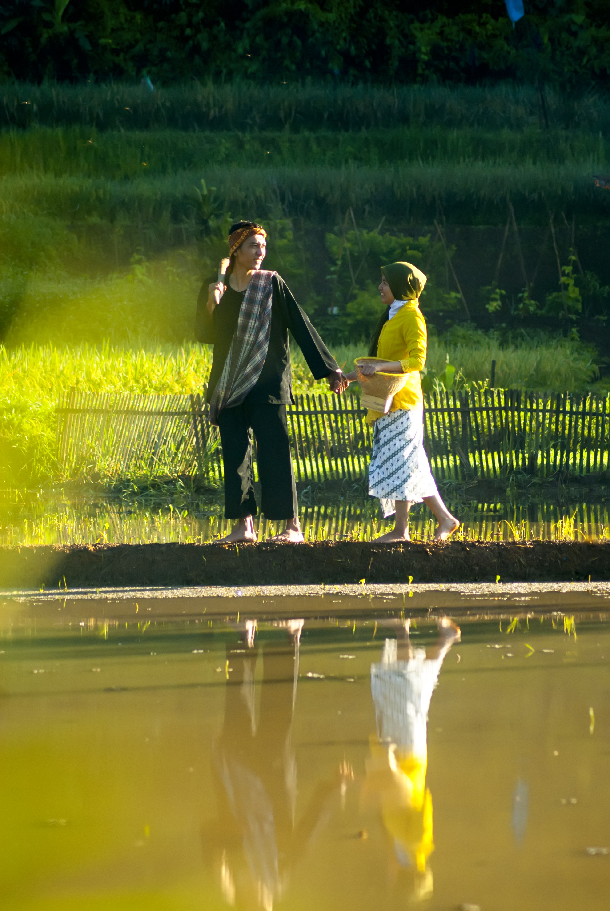
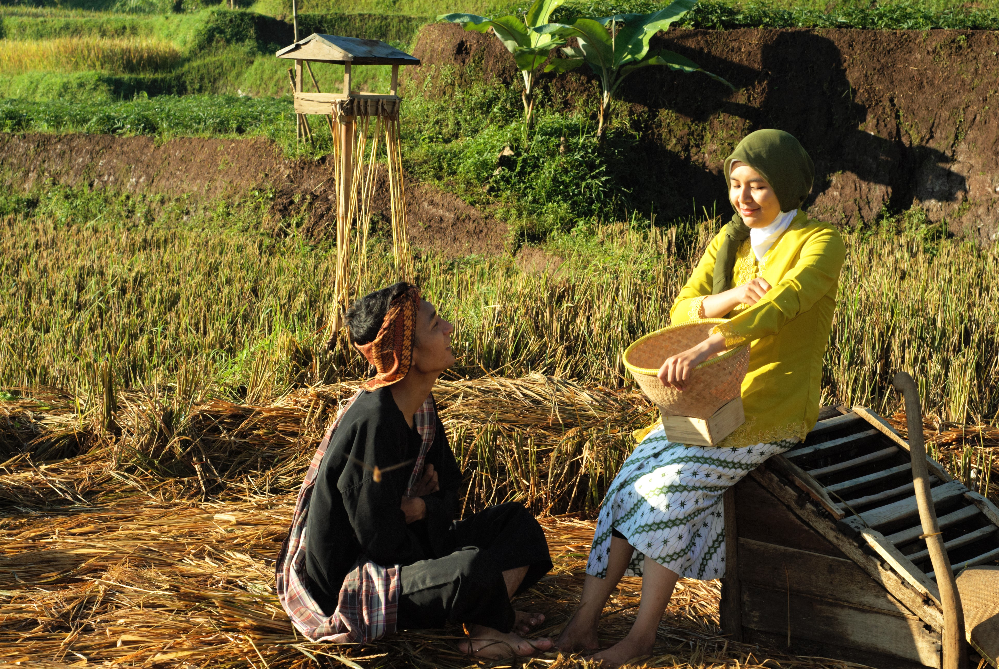
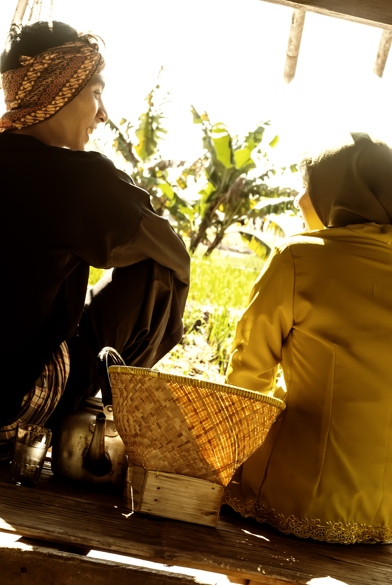
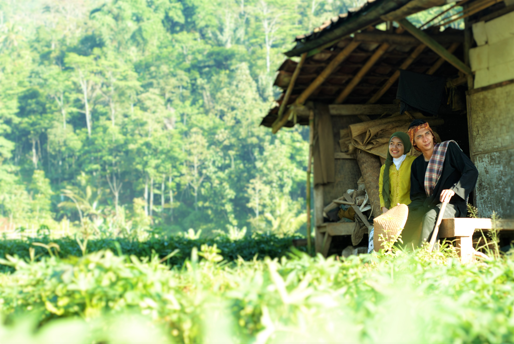

Lokasi pengambilan foto berada di daerah Tanjung Sari yaitu daerah yang dilewati oleh para pengemudi setelah Jatinangor apabila mengambil dari arah Bandung.

Namun ternyata dari Tanjung Sari menuju tempat pengambilan foto membutuhkan waktu kurang 55 menit.

Karena jalan menuju desa banyak melewati rintangan pembangunan tol cisudawu. Desa Cibunar dengan Kecamatan Rancakalong, Kabupaten Sumedang.

Desa yang ternyata masih menyimpan keasriannya dengan jarak tempuh yang tak terlalu jauh dari pusat kota Bandung. Terdapat sebuah bukit atau bisa dikatakan juga gunung.

Karena pada saat kami tiba pukul 11 siang puncaknya tertutup oleh halimun begitu pula pada saat keesokan harinya ketika pulang pukul 13.00 puncaknya selalu tertutup halimun.

Orang-orang desa menyebutnya dengan Gunung Cupu, entah mereka demikian menyebutnya. Tepat di kaki gunung cupu terdapat sebuah mata air yang bernama "Gandasoli".

Ingin kami kesana namun tampaknya waktu yang tak mengizinkan. Suasana pedesaan yang asri serta pesawahan adalah hal yang ingin ditampilkan dalam setiap potret.

### Prewedding Ayu

 
*Pagi Hari*

 
*Mengawali Hari*

*Saling Menatap*

 
*Menunggu Dipanen*

 
*Hanya Berdua*

 
*Berbaur*

 
*Melepas Dahaga*

[Istirahat](images/Istirahat.jpg)] 
*Beristirahat Sejenak*

 
*Kontemplasi*

 
*Kembali Ke Pondok Sederhana*
