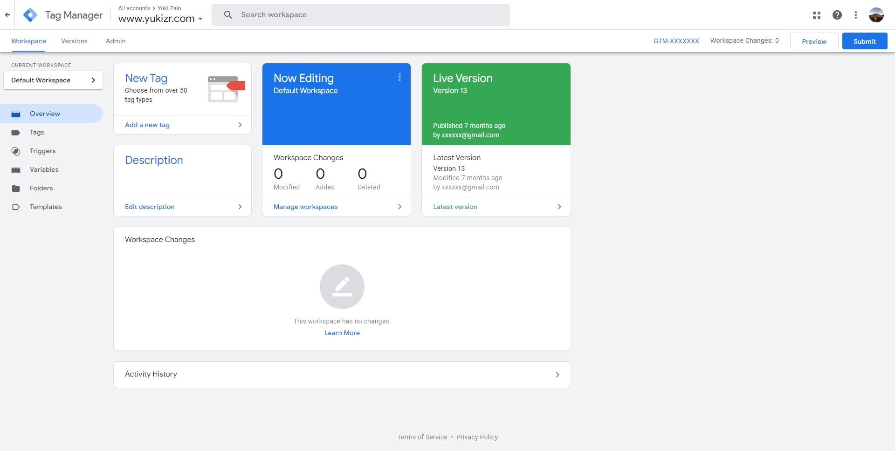
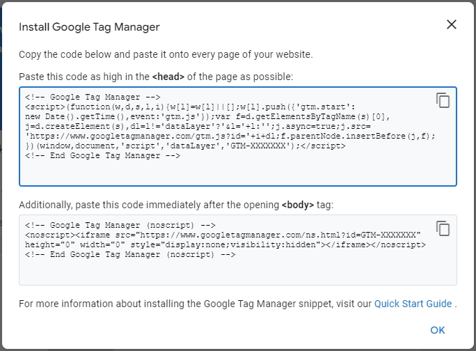
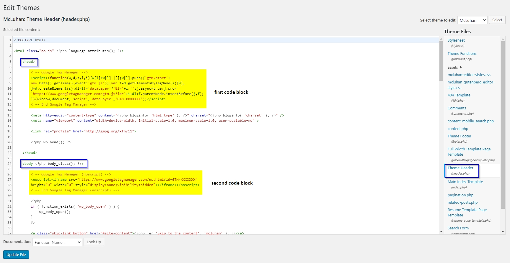
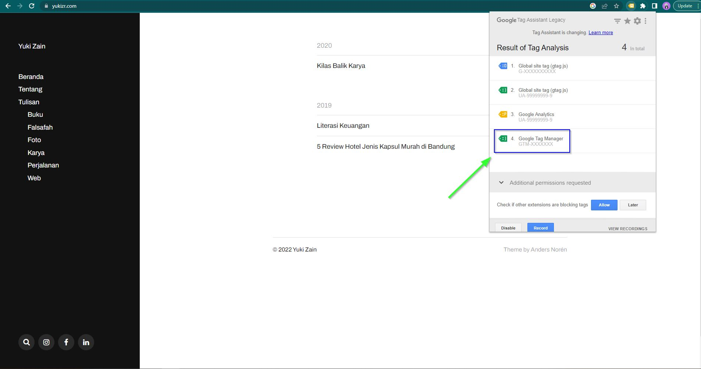
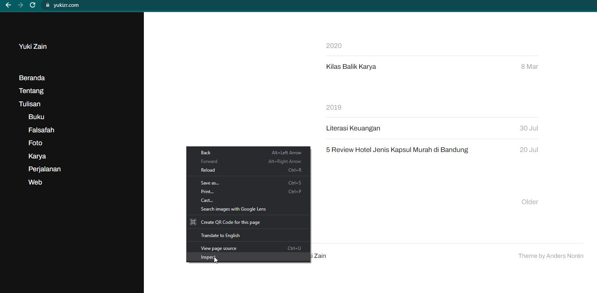
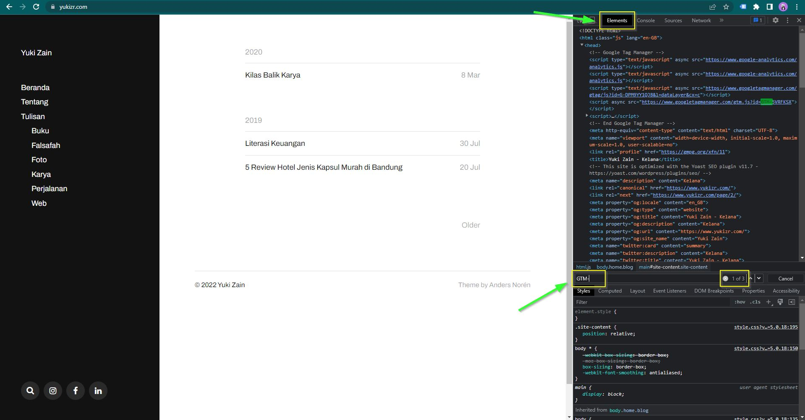

This is my maiden article in English. Writing a simple tutorial on a popular topic is my way that hopefully to get broad viewers further. I want to give a simple tutorial about how to install Google Tag Manager on WordPress by editing themes directly. This tutorial is suitable for you if your themes don’t have any features to add any extra tracking. This usually happens with free WordPress themes.

## Open your Google Tag Manager Account

## Click your container ID on the top right of the window (formatted GTM-XXXXXXX)

## Make sure the code is present on all your page

Put the first code block after opening `<head>` tag. While putting the second code block after opening `<body>` tag.

## Open your WordPress then go to the menu Appearance > Editor > header.php

1. Put the first code block after `<head>` tag
2. The second code block after `<body>` tag
3.  Click Update file once everything is okay

## Verify

My tutorial offers two options:

1. [Installing Google Tag Manager extensions (if you Chrome user)](#install_extensions)
2. [See the code present through inspect element on your browser](#inspect_manually)

## Install Google Tag Manager extensions

1. Open the Chrome web store and [install extensions Tag Assistant Legacy (by Google)](https://chrome.google.com/webstore/detail/tag-assistant-legacy-by-g/kejbdjndbnbjgmefkgdddjlbokphdefk)
2. Open your blog > Click the extension > Click enable > Refresh the page > Done

## Inspect Manually via Browser Console

1\. On your browser press F12 or click right “Inspect”

2\. Go to Elements tab > Ctrl + F

3\. Look up “GTM-”, it will have 3 results. Congrats, you’ve been installed properly!

