23 Desember 2015

Gorontalo adalah kota pertama yang kujelajahi di luar pulau Jawa. Yah juga pertamakalinya menggunakan moda transportasi udara alias pesawat terbang. Kisah ini bermula saat mengambil kesempatan untuk menjadi auditor dadakan.

Tugasku sebenarnya adalah pergi ke daerah Jakarta Timur, namun ada kabar pada telepon genggam yang memberikan info bahwa tak usah untuk pergi ke ibukota karena akan digantikan oleh orang lain. Sementara diriku akan pergi bertugas ke kota Gorontalo serta Makassar. Tentu saja langsung kuiyakan tanpa berpikir terlebih dahulu.

Orang-orang mewartakan bahwa tempatku bertugas itu memiliki beban pekerjaan yang sulit serta tak ada libur nasional yang cukup panjang di akhir tahun. Bagiku menjelajahi tempat baru adalah berlibur, dan sepanjang 22 hari akan terus menerus menemui tempat baru. Jadi itu sama saja dengan berlibur bagiku.

Oke cukup untuk pembukaannya deh yang awal kisah ini bermula yang ceritanya pengen mirip tulisan maestro Pramoedya Ananta Toer _\*janganngimpibung_, ya udah deh kita langsung aja yah menuju poin terpentingnya yaitu tentang Benteng Otanaha _\*yippy_

Kota Gorontalo itu bisa dibilang sepi untuk ukuran ibukota provinsi, kalo di derah pinggiran Bandung sih mirip kecamatan Cililin yang tekenal akan wajitnya itu dan kota Gorontalo beda jauh deh sama Bandung yang tiap Senin pagi dan Jumat sorenya mirip Jakarta untuk macetnya hoho.

Sekilas info tentang sejarahnya dulu yah supaya waktu di lokasi kita akan sedikit termenung soal keadaannya dahulu dan latar belakang dibalik terciptanya supaya oleh-olehnya bukan hanya sekedar foto-foto aja yah _Guys :p_

Jadi menurut hasil saduran dari [sini](http://www.gocelebes.com/benteng-otanaha-gorontalo/), Benteng Otanaha didirikan sebagai benteng pertahanan, benteng ini dibangun oleh Raja Ilato pada tahun 1522 Masehi.

Dengan prakarsa pemimpin-pemimpin kapal Portugis yang berhenti di pelabuhan Gorontalo. Benteng yang terbuat dari pasir, batu kapur dan telur Burung Maleo ini sangat kuat meskipun semennya terbuat dari telur.

Salah satu sudut Benteng Otanaha terdapat cerita tentang Benteng Otanaha ini, dulu kala Raja Ilato mempunyai 3 orang anak, 2 orang putri dan 1 orang putra yang bernama Ndoba, Naha dan Tiliaya.

Pada saat usianya menginjak remaja, Naha pergi ke negeri seberang untuk merantau, dan kedua saudara perempuan yang lainnya tetap tinggal di Kerajaan Gorontalo.

Pada tahun 1585, Naha berniat kembali ke Gorontalo dan mempersunting Ohihiya. Singkat cerita, mereka dikaruniai 2 orang anak, Paha dan Limonu.

Suatu hari terjadilah perang dengan Hemuto, pemimpin transmigran. Naha dan Paha pun akhirnya tewas dalam peperangan tersebut. Limonu yang tidak terima atas kematian kakak dan ayahnya pun menuntut balas.

Untuk mengenang perjuangan mereka dalam perang melawan _Hemuto_, maka dari itu benteng tersebut diberi nama benteng Ulupahu, benteng Otahiya dan _benteng Otanaha_.  Di dalam perkembangannya, benteng tersebut lebih populer dengan sebutan Benteng Otanaha.

Nah segitu dulu yah buat sejarahnya, sekarang langsung lanjut ke bawaah.

> Disaranin sih kalo ke [Benteng Otahana](http://yukizr.com/jelajah-benteng-otanaha/) saat Golden Hour alias pagi hari sampai maksimal kurang pukul 9 ataupun sore hari dari pukul 4 ataupun setelah sholat Ashar bagi yang muslim.
> 
> Karena menurut pengalaman abang \*ehm yang datang pukul setengah 3 saat tiba kondisi matahari masih terik.
> 
> Lalu jangan lupa juga segalon sebotol minuman buat pelepas dahaga di perjalanan saat mendaki ke puncak benteng. Dan gunakan alas kaki yang nyaman juga yah _Guys!_

Karena menginap pada Hotel Santika yang terletak pada Jalan Sultan Botuhite otomatis tiap hotel pasti ada bentor a.k.a becak motor. Sebelumnya saya tanya dulu tarifnya ke satpam hotel berapa harga yang termurah pantas untuk menuju ke sana.

Menurutnya untuk kisaran 50 Ribu pulang pergi sudah termasuk murah, bahkan beliau memanggilkan bentor langganan yang biasa mengantarkan para tamu untuk berkeliling Gorontalo. Oke tarik baaang.

Dari hotel dibutuhkan kurang lebih 20 menit untuk ke benteng, sebenarnya sih bisa 15 menit karena jalan kosong tapi yakin mau kamu naik bentor yang ngebut sampai 80 Km/h, yang ada sih bisa deg-degan haha.

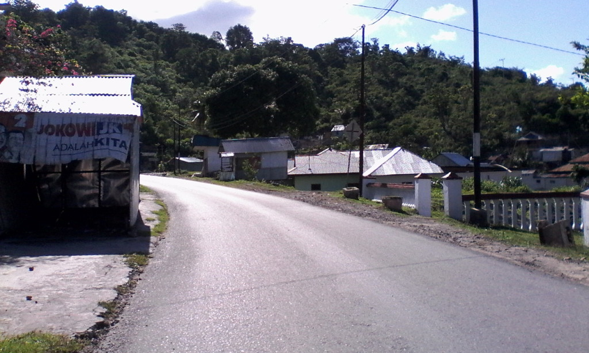 
*Saking Kosongnya Jalan Kamu Bisa Tiduran Kayaknya :P*

Oh iyah bila kamu berkunjung ke sini maka kamu bisa mendapatkan dua objek wisata sekaligus yakni melihat indahnya Danau Limboto dari dari ketinggian karena FYI Benteng Otanaha ini terletak di atas bukit jadi selain murah meriah indah juga merupakan tempat yang wajib bila datang ke Gorontalo.

Jalannya mengelilingi pinggiran danau yang sudah menjadi kebun dan rumah warga lalu perbukitan kapur milik warga setempat, dulu kata si abang bentor danau ini luas dan hasil ikan khas nya masih mudah ditemui cuman sekarang kondisinya cukup mengkhawatirkan.

Semoga pemerintahnya benar-benar serius untuk menjaga Danau Limboto karena selain ikon kota Gorontalo juga tempat mata pencaharian para warga setempat yang menggantungkan hidupnya dari sisi wisata danau seperti si abang pengemudi bentor ini.

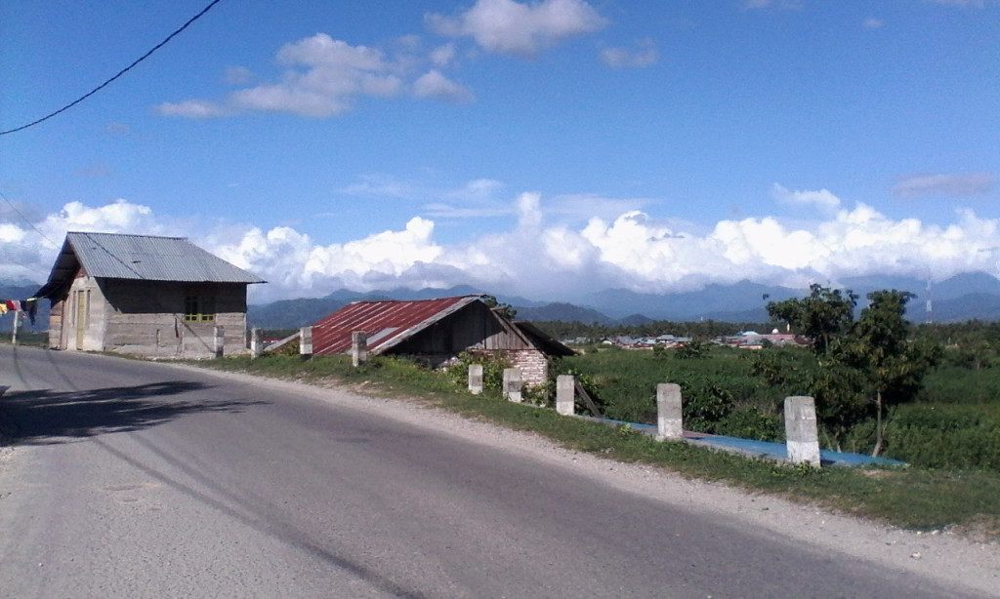
*Sisi Danau Yang menjadi Kebun Serta Pemukiman*

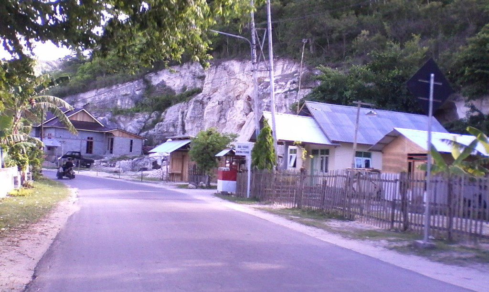
*Tambang Kapur Rakyat*

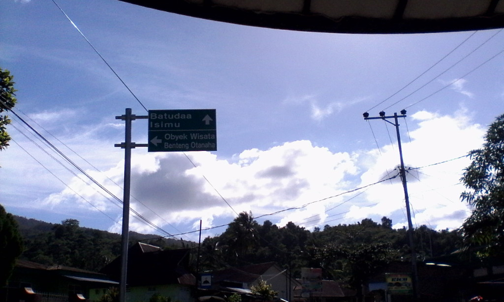
*Petunjuk Jalan*

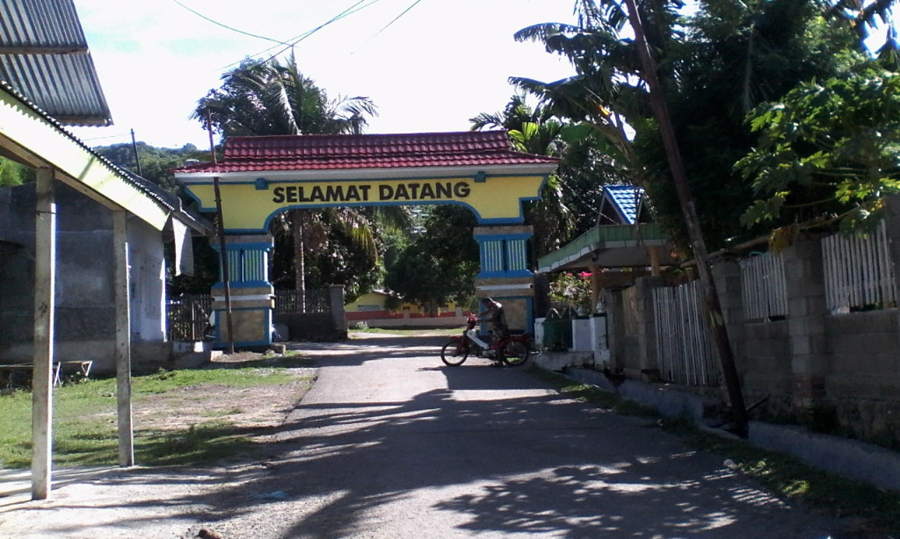
*Gerbang Pertama Penyambutan*

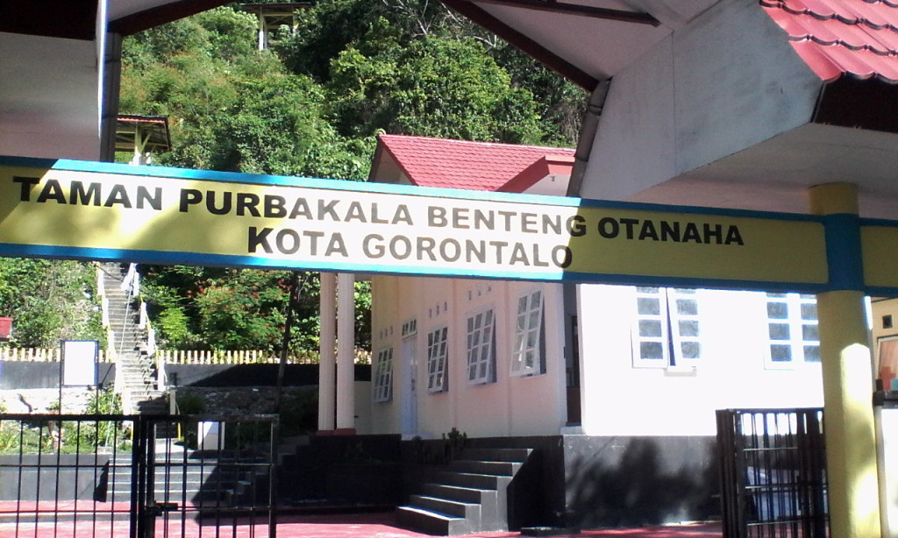
*Gerbang Utama Benteng Otanaha*

Akhirnya kita tiba deh di Benteng Otanaha, nah gambar di atas adalah satu dari dua jalan menuju ke benteng. Jadi gerbang seperti foto di atas adalah gerbang yang mengharuskan kita untuk mendaki anak tangga yang jumlahnya kurang lebih 325 anak tangga, yah salah hitung sedikit gak masalah yah _Guys :D_ \*abislelah.

Setelah membayar uang masuk yang hanya Rp 5.000 untuk wisatawan lokal dan $ 1.000.000.000 (kalo engga salah) buat wisatawan Zimbabwe.

Maka siap-siap kamu harus anak tangga yang sudut kemiringan tanjakannya bisa 60 derajat buat kamu yang akan melalui gerbang satu.

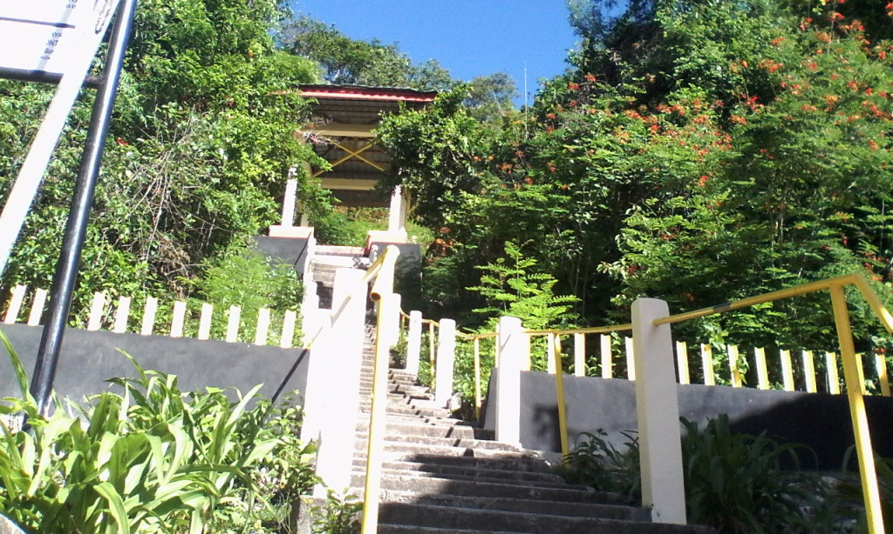
*Jalur Pendakian*

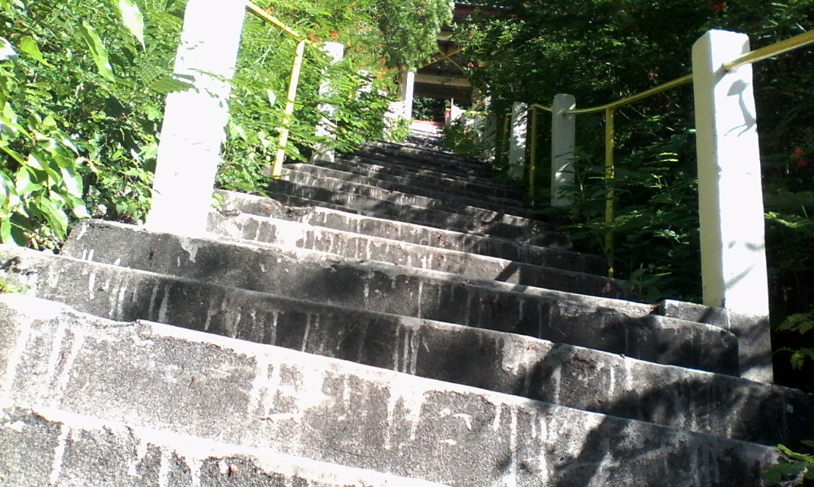
*Yah Segini Mah Cemen :(*

_Guys_ jalur pendakiannya sih ga seberapa jauh kalo lurus hihi, setelah mendaki sekitar 10 menit karena saking semangatnya mendaki tibalah kita di puncak sekaligus Benteng Otanaha. Rasa capek yang mendera selama mendaki pokoknya terbayarkan deh saat liat pemandangan [Danau Limboto](http://yukizr.com/jelajah-benteng-otanaha/).

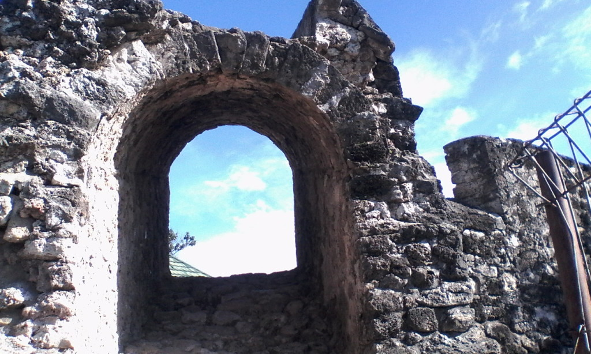
*Akhir Pendakian*

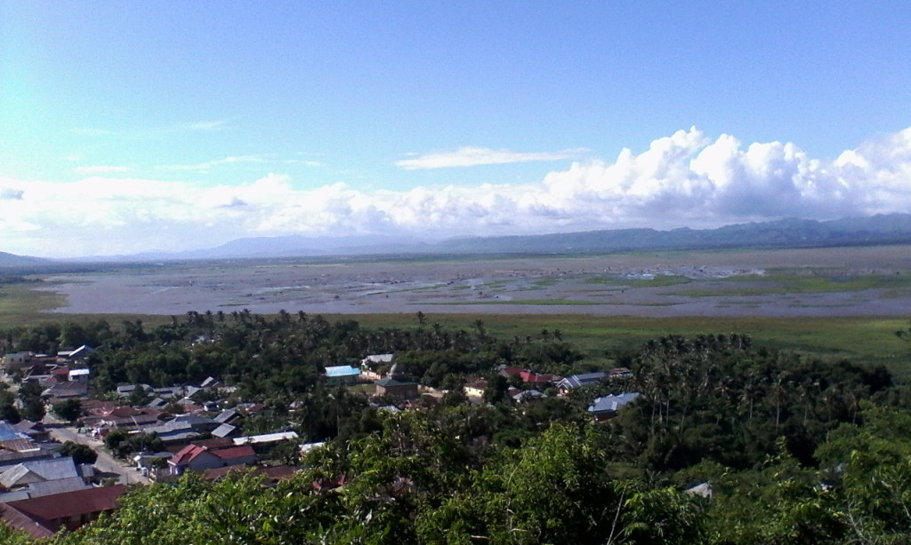
*Pemandangan Danau Limboto*

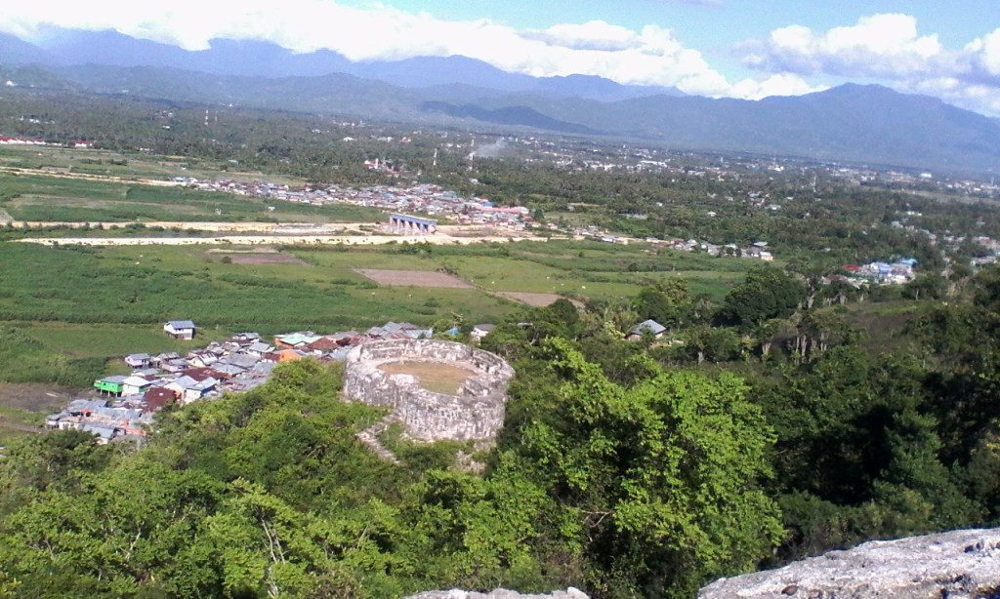
*Sisi Lain Benteng Otanaha*

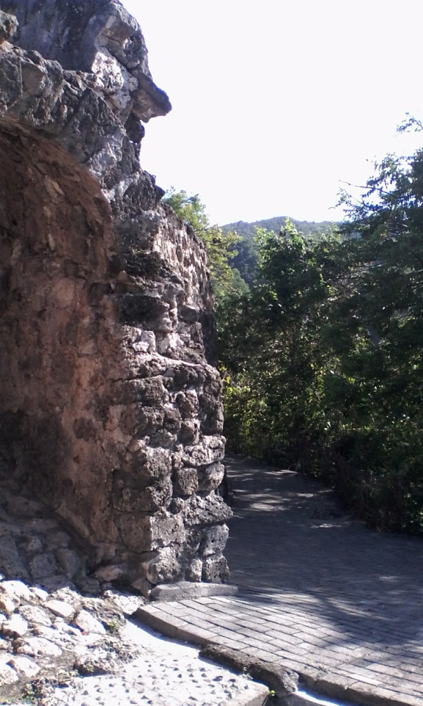
 
*Jalur Ke Gerbang Dua Benteng Otanaha*

Oke jadi untuk biaya untuk ke Benteng Otanaha dari titik Hotel Santika, Jalan Sultan Botuhite adalah : 

   Item    | Biaya
-----------|------
  Bentor | Rp 50.000
  Tiket masuk    | Rp 5.000
  **Total** | **Rp 55.000**

<!-- Nantikan juga tulisan berikutnya yang akan curhat yang tersesat saat jalan-jalan ke Benteng Rotterdam – Makassar. Kalo kamu punya cerita yang sama boleh dong cerita juga di bawah :D -->
