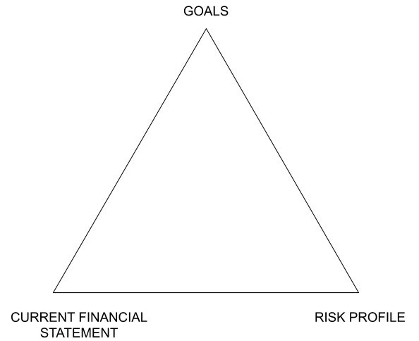
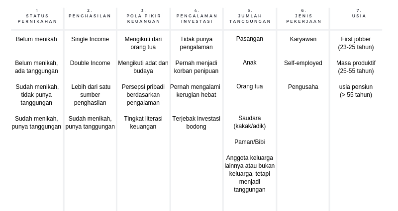
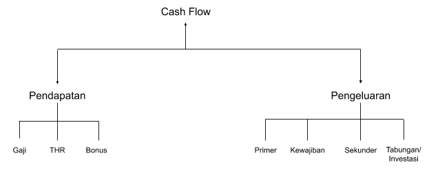
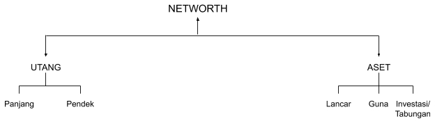

Literasi keuangan menurut saya pribadi adalah sebuah ilmu dasar yang harus diajarkan sedini mungkin.

Harapannya adalah seseorang akan lebih bijak dalam mengelola keuangannya, sehingga dapat berpijak sendiri dan bahkan membantu orang-orang yang kurang beruntung di sekelilingnya.

Tulisan ini secara keseluruhan diambil dari sebuah majalah terbitan Jouska yang berjudul _The Principle of Personal Finance_. Lalu saya tuliskan ulang sebagai panduan untuk pribadi.

Enjoy it!

<!-- 1. [The Basic Triangle](#the-basic-triangle)  
    1.1 [Risk Profile](#risk-profile)  
    1.2 [Current Financial Statement](#current-financial-statement)  
    1.2.1 [Cash Flow Statement](#cash-flow-statement)  
    1.2.2 [Net Worth Statement](#net-worth-statement)  
              a. [Asset](#assets)  
              b. [Debt](#debt)  
    1.3 [Goals](#goals)  
    1.3.1 [Compulsory Goals](#compulsory-goals)  
    1.3.2 [Additional Goals](#additional-goals)
2. [Shield Your Assets](#shield-your-assets)  
    2.1 [Life Insurance](#life-insurance)  
    2.2 [Health Insurance](#health-insurance)
3. [Marry With Your Bank](#marry-with-your-bank)
4. [The Importance of Emergency Fund](#the-importance-of-emergency-fund)  
    4.1 [Emergency Fund Formula](#emergency-fund-formula)
5. [Grow Your Assets](#grow-your-assets)  
    5.1 [Bonds](#bonds)  
    5.2 [Stocks](#stocks) -->

* * *

## 1\. The Basic Triangle

Mengetahui posisi keuangan saat ini adalah hal yang penting sebelum kita melangkah jauh menuju mengembangkan aset atau sekedar mengatasi masalah keuangan yang sedang berlangsung.

The Basic Triangle Method adalah metode yang digunakan para perencana keuangan untuk menelaah posisi keuangan si klien.

Untuk mencapai Goals kamu membutuhkan dua pondasi sebelum membuat strategi keuangan.

Yakni Risk Profile (Profil Risiko) dan Current Financial Statement (Kondisi Keuangan Saat Ini).

### 1.1 Risk Profile

Ada 7 kategori profil risiko yang wajib kamu ketahui sebelum membuat rencana keuangan.

### 1.2 Current Financial Statement

Dalam keuangan pribadi terdapat dua kunci utama, yaitu **penghasilan** (income) dan **kekayaan** (wealth).

Penghasilan digunakan untuk pengeluaran baik yang bersifat primer, sekunder, maupun tersier.

Sementara itu, kekayaan adalah sesuatu yang masih dapat kamu gunakan meskipun tidak memiliki penghasilan lagi.

Contohnya membangun sumber-sumber penghasilan baru melalui portofolio investasi.

Dapat kita perhatikan bahwa saat ini masyarakat mulai mengalami peningkatan terhadap penghasilan dikarenakan mulai banyaknya kesempatan dalam mengembangkan potensi diri.

Tentunya ini berimbas pada jumlah penghasilan yang didapat. Namun sayangnya tidak diikuti dengan peningkatan pada literasi keuangan.

Dalam pandangan keuangan pribadi terdapat sebuah istilah _Middle Income Trap_ atau jebakan pendapatan menengah.

Istilah ini ditunjukkan kepada seseorang yang telah berpenghasilan menengah, namun level kekayaannya yang tidak jauh berbeda selama bertahun-tahun.

Perlu kita pahami bahwa orang yang memiliki penghasilan relatif tinggi belum tentu memiliki jumlah kekayaan yang besar pula.

Namun, jika penghasilan dapat dikelola dengan baik, maka hasilnya kekayaan yang terus bertumbuh.

Oleh karenanya seseorang wajib selalu meninjau dua laporan keuangannya, antara lain.

#### 1.2.1 Cash Flow Statement

Dalam bahasa Indonesia diartikan sebagai **Laporan** **Arus Kas**. Laporan ini memperlihatkan bagaimana cara seseorang mengelola penghasilannya sehingga ada porsi dari penghasilannya yang dapat dikelola kembali untuk meningkatkan jumlah aset yang dimiliki.

Pertanyaannya adalah bagaimana mengelola penghasilan berdasarkan jenis pekerjaan dan jumlah penghasilan yang diterima saat ini.

Namun ternyata kamu harus terlebih dahulu mengevaluasi keempat jenis pengeluaran.

**Pengeluaran Primer** adalah pengeluaran pokok pribadi maupun keluarga yang harus dikeluarkan setiap bulannya. Pengeluaran pokok ini wajib ada demi kelangsungan hidup

**Pengeluaran Kewajiban** adalah pengeluaran yang harus dikeluarkan kepada pihak lain untuk menerima manfaat kemudahan/fasilitas yang diberikan oleh pihak tersebut. Pengeluaran sosial seperti zakat/perpuluhan serta bantuan keluarga termasuk dalam pengeluaran kewajiban.

**Pengeluaran Sekunder** adalah pengeluaran yang hanya dikeluarkan setelah pengeluaran primer dan kewajiban terpenuhi. Pengeluaran sekunder adalah pengeluaran yang dapat disesuaikan dengan tingkat kewajaran.

**Tabungan dan Investasi** harus diperlakukan selayaknya pengeluaran wajib, sehingga harus disisihkan setiap bulan/tahun.

Terkait dengan menabung dan investasi, seringkali kita bertanya-tanya berapakah persentase yang harus kita sisihkan untuk menabung dan berinvestasi?

Ternyata setiap individu memiliki latar belakang dan profil yang berbeda sehingga tidak dapat disamakan.

Sistem yang digunakan oleh Jouska adalah sistem budgeting yang disesuaikan dengan tujuan keuangan yang ingin dicapai.

Jadi, semakin banyak tujuan prioritas maupun tambahan (additional), maka semakin banyak pula jumlah dana yang harus disisihkan untuk investasi.

Lalu dari sisi waktu, pengeluaran terbagi menjadi dua yakni bulanan dan tahunan.

Pengeluaran tahunan wajib untuk dipersiapkan juga. Jika tidak maka akan mengganggu pos lainnya.

Pengeluaran tahunan bisa disiapkan dengan menabung setiap bulannya atau menyisihkan penghasilan tahunan seperti bonus dan THR.

Singkatnya laporan arus kas dapat menjawab beberapa pertanyaan yang sering kamu tanyakan seperti:

1. Kenapa saya tidak bisa menabung setiap bulannya?
2. Kenapa setiap kali saya menabung selalu ada saja pengeluaran besar yang harus dilakukan?
3. Kenapa posisi aset saya tidak berubah meskipun saya sudah bekerja selama bertahun-tahun?

#### 1.2.2 Net Worth Statement

Dalam bahasa Indonesia diartikan sebagai **Laporan** **Kekayaan Bersih**. Laporan ini menggambarkan kondisi keuangan saat ini dan bagaimana seseorang dalam mengelola asetnya selama ini.

Laporan ini menampilkan level literasi seseorang terhadap produk keuangan.

Kondisi kekayaan bersih yang ideal adalah ketika jumlah total aset jauh lebih besar dari jumlah total keseluruhan utang yang dimiliki.

Namun mereka yang tak memiliki utang tidak lantas bisa dikatan berada di kondisi keuangan yang aman.

Jika aset yang dimiliki tidak dikelola dengan tepat, maka ini bisa dipastikan menjadi masalah pada kemudian hari.

Secara perhitungan apabila arus kas sudah dikelola dengan bijak, maka kekayaan bersih pun bertumbuh. Jadi apakah itu kekayaan bersih?

Bila kekayaan adalah jumlah aset yang dimiliki saat ini. Maka kekayaan bersih adalah jumlah total aset setelah dikurangi total utang.

Total kekayaan bersih ini digunakan untuk mengetahui tingkat kekayaan seseorang.

Laporang kekayaan bersih yang ideal adalah ketika **jumlah aset > jumlah utang**.

Lalu jumlah utang yang ideal tidak boleh melebihi 30% dari total keseluruhan aset.

##### **a. Asset**

Asset atau aset dalam bahasa Indonesia adalah sumber ekonomi atau kekayaan yang dimiliki dan dikendalikan oleh seseorang.

Sumber ekonomi atau kekayaan tersebut memiliki nilai ekonomis dan diharapkan dapat memberikan keuntungan di masa depan.

Sumber ekonomi atau kekayaan adalah semua sumber daya yang dapat berupa bentuk apapun sepanjang dapat diubah atau dapat memberikan sumber penghasilan.

Aset terbagi menjadi tiga jenis, antara lain:

**1\. Aset Lancar**

Aset lancar adalah aset yang sifatnya mudah dicairkan dalam waktu singkat dengan sedikit atau tidak ada kerugian sama sekali secara nominal.

Dari sudut pandang Personal Finance untuk jumlah aset lancar yang ideal dapat mengikuti teori.

Atau disesuaikan dengan jumlah dana darurat ideal bagi masing-masing individu dan keluarga.

Serta jumlah dana yang dibutuhkan untuk tujuan keuangan jangka pendek.

Secara teori total aset lancar yang ideal berkisar antara 15% hingga 20% dari total keseluruhan aset.

Apabila kurang, maka kondisi keuangan menjadi tidak aman jika butuh dana mendesak.

Apabila berlebihan, maka aset tidak akan berkembang secara optimal.

Contoh aset lancar:

1. Tabungan
2. Deposito
3. Mata uang asing
4. Reksadana pasar uang
5. Logam mulia

**2\. Aset Investasi**

Aset investasi adalah aset yang dapat memberikan salah satu hal dibawah ini:

1. Capital Gain  
    Aset investasi yang tidak memberikan sumber pendapatan dalam waktu singkat.  
      
    Tetapi diharapkan memberikan keuntungan yang jauh lebih tinggi di masa depan.  
      
    Contoh: saham, properti yang dijual, kenaikan harga obligasi ketika dijual atau jatuh tempo.
2. Cashflow  
    Aset investasi yang dapat memberikan sumber pendapatan rutin setiap bulan atau tahunnya.  
      
    Contoh: properti yang disewakan, kupon obligasi, dividen dari saham.
3. Collateral  
    Aset investasi yang tidak hanya memberikan pendapatan tetapi juga dapat dijadikan jaminan jika timbul kebutuhan untuk meminjam dari pihak ketiga.  
      
    Contoh: properti, surat berharga yang aktif diperdagangkan di BEI dan memiliki peringkat nilai investasi (obligasi dan saham).

Bilamana total aset investasi sudah lebih dari 50% dari total keseluruhan aset. Maka kebebasan finansial merupakan hal yang mutlak.

Untuk mencapai posisi tersebut diperlukan kesabaran lantaran proses yang tidak sebentar.

**3\. Aset Guna**

Aset guna adalah aset yang digunakan untuk keperluan pribadi maupun keluarga.

Dan tidak akan digunakan sebagai sumber pendapatan saat ini maupun di masa depan, jika tidak harus atau terpaksa.

Total aset guna idealnya hanya sejumlah kebutuhan primer seperti tempat tinggal dan kendaraan untuk beraktivitas.

Semakin banyak aset guna, maka semakin besar pula pajak dan pengeluaran yang berhubungan dengan aset tersebut yang harus dikeluarkan.

Contoh aset guna:

1. Rumah yang ditempati
2. Kendaraan yang digunakan untuk beraktivitas

##### **b. Debt**

Hutang atau liabilitas adalah pinjaman yang dilakukan oleh individu untuk memenuhi kebutuhan primer dan sekunder.

Berdasarkan jangka waktu utang dibagi menjadi dua kategori:

1. **Utang Jangka Pendek (0-1 tahun)**  
    Contoh utang jangka pendek adalah utang kartu kredit, sisa berbagai cicilan kurang dari 1 tahun.
2. **Utang Jangka Panjang (> 1 tahun)**  
    Contoh utang jangka panjang adalah Kredit Kepemilikan Rumah (KPR), KPA, KTA, Kredit Multi Guna, dan lain sebagainya.

Berdasarkan fungsi utang dibagi menjadi dua kategori:

1. **Utang Konsumtif**  
    Utang yang digunakan untuk membeli suatu barang atau aset yang nilainya akan turun seiring berjalannya waktu.  
      
    Barang ataupun aset ini juga tidak digunakan untuk hal yang produktif.  
      
    Contoh: utang kartu kredit, kredit tanpa agunan, peer to peer lending untuk kebutuhan konsumtif.
2. **Utang Produktif**  
    Utang yang digunakan untuk membeli suatu barang atau aset yang nilainya akan naik seiring berjalannya waktu.  
      
    Contoh: KPR, kredit modal usaha, kredit mobil yang akan disewakan.

Secara teori **posisi utang yang ideal** adalah:

1. Jika total cicilan tidak melebihi 30% dari total penghasilan
2. Jika total sisa utang tidak melebihi 50% dari total keseluruhan aset

Namun para Personal Finance pada praktiknya mengizinkan total cicilan 50% dari discretionary income (sisa penghasilan setelah dikurangi dengan pengeluaran primer, kewajiban dan sekunder).

Jika discretionary income Rp.5.000.000,- maka total cicilan hanya diperbolehkan sebesar Rp.2.500.000,-. Mengapa begitu? Karena setiap cicilan memiliki **butterfly effect.**

Butterfly effect adalah ketergantungan yang sensitif pada kondisi awal ketika perubahan kecil dalam satu keadaan dapat menghasilkan perbedaan besar dalam keadaan selanjutnya.

Mari kita bahas dengan studi kasus membeli mobil dengan cara mencicil.

a. Gaji: Rp.45.000.000,-

b. Max. total cicilan: Rp.45.000.000 - 30% = Rp.13.500.000,-

c. Harga mobil: Rp.518.000.000,-

d. Cicilan per bulan (3 tahun): Rp.12.309.000,-

Rp.13.500.000 - Rp.12.309.000 = Rp1.191.000,-

Kondisi ini masuk dalam kategori sehat karena masih ada selisih sisa anggaran cicilan **Rp.1.191.000,-**

Cost Butterfly Effect:

a. Bensin (per bulan): Rp.2.500.000,- (contoh)

b. STNK

c. Pemeliharaan

d. Parkir

Jika semua biaya dihitung, maka biaya tambahan dari keputusan pembelian mobil adalah cukup besar.

Skema diatas baru contoh untuk pembelian mobil. Perlu diingat juga kita masih memiliki tujuan keuangan lain yang harus dipenuhi.

Seperti dana pendidikan anak, dana pembelian rumah, dana pensiun dan lain sebagainya.

### 1.3 Goals

Goals di sini adalah tujuan keuangan yang harus disesuaikan dengan prioritas dari kebutuhan individu/keluarga dan juga jangka waktu untuk mencapai target dari tujuan tersebut.

Tujuan keuangan dibagi menjadi dua, yakni:

#### 1.3.1 Compulsory Goals

Tujuan wajib dalam keuangan yang harus disiapkan dan tidak boleh ditunda. Penundaan akan memberikan masalah keuangan di masa yang akan datang.

Contohnya:

1. Dana Darurat  
    Wajib dimiliki untuk menghindari risiko berutang maupun menjual aset tetap dalam keadaan mendesak.
2. Asuransi  
    Untuk memproteksi diri sendiri dan keluarga. Jumlah premi yang dikeluarkan tidak sebanding dengan risiko biaya yang harus dikeluarkan jika tidak ada perlindungan.
3. Restrukturasi Utang  
    Untuk mengurangi jumlah cicilan utang dengan cara negosiasi ke pihak peminjam maupun di alihkan ke institusi keuangan lainnya.  
      
    Hal ini dilakukan agar ada dana lebih pada kas yang dapat digunakan untuk tujuan keuangan lainnya, sehingga tidak hanya habis untuk membayar utang.
4. Dana Pensiun  
    Untuk menyiapkan hari tua yang nyaman dan tidak membuat anak-anak kita menjadi **sandwich generation** yang harus menanggung keluarga kecil mereka serta orang tua.
5. Dana Pendidikan Anak  
    Biaya yang dikeluarkan untuk biaya ini tidaklah sedikit. Maka harus dipersiapkan jauh-jauh hari.

#### 1.3.2 Additional Goals

Tujuan tambahan dalam keuangan atau baru dapat dipenuhi setelah compulsory goals sudah berjalan.

Contoh:

1. Dana Pembelian Properti  
    Ada saran yang mereka berikan yakni belilah properti jika memang sudah butuh dan mampu.  
      
    Tak perlu gengsi untuk tinggal di rumah orang tua atau mengontrak sembari mengumpulkan down payment sebesar-besarnya.  
      
    Sehingga cicilan di kemudian hari tidak menjadi besar dan tidak perlu meminjam terlalu lama.
2. Dana Pembelian Mobil  
    Belilah sesuai anggaran dan kebutuhan. Membeli secara tunai lebih disarankan.  
      
    Jika membeli dengan skema cicilan pastikan jangka waktu tidak terlalu lama, karena mobil mengalami penurunan nilai setiap tahunnya.
3. Dana Liburan  
    Sesuaikan dengan anggaran dan tidak perlu memaksakan diri demi sebuah foto untuk mempercantik timeline media sosial.
4. Modal Usaha  
    Modal yang dikeluarkan jangan sampai mengganggu keuangan keluarga. Akan lebih baik jika dapat memulai dengan modal seminim mungkin.

* * *

## 2.Shield Your Assets

Aset dalam ilmu Personal Finance memang terbagi menjadi tiga yaitu aset lancar, aset investasi dan aset guna.

Namun, ada aset yang lebih penting yaitu diri kita sendiri beserta keluarga.

Kita tidak akan pernah tahu kapan risiko akan datang karena itu di luar hal yang bisa kendalikan. Namun, ketika risiko itu terjadi maka apaka kita sudah memastikan diri beserta keluarga aman secara finansial?

Paling tidak, kepergian kita cukup memberikan kesedihan secara batin, bukan secara finansial.

### 2.1 Life Insurance

Asuransi jiwa adalah program perlindungan dalam bentuk pengalihan risiko ekonomis atas meninggal atau hidupnya seseorang yang dipertanggungkan.

Jika seseorang meninggal tapi telah mendaftar asuransi. Maka akan dana yang keluar untuk keluarga yang ditinggalkan.

Seringkali kita bertanya **siapa yang layak memiliki asuransi jiwa**. Untuk menjawabnya ada dua syarat yang harus dipenuhi, yakni:

1. Memiliki penghasilan
2. Mempunyai tanggungan

Jadi sebelum membeli asuransi jiwa pastikan harus memahami siapa yang menjadi tertanggung, berapa jumlah uang pertanggungan, dan produk asuransi jiwa apa yang seharusnya dipilih.

Maka oleh dari itu kita paling tidak wajib mengetahui dua istilah sebagai berikut:

**1\. Tertanggung**

Pihak yang di daftarkan / di asuransikan / dilindungi nilai ekonomisnya. Disarankan mendaftarkan seseorang yang telah memenuhi dua syarat untuk memiliki asuransi jiwa. Maka nama tertanggung adalah nama yang di asuransikan.

Jika menaruh nama anak sebagai tertanggung, maka dana hanya keluar ketika terjadi risiko terhadap anak.

**2\. Uang Pertanggungan**

Sejumlah uang yang akan diberikan oleh perusahaan asuransi kepada ahli waris. Apabila terjadi risiko meninggal terhadap tertanggung.

Maka kamu lah yang menentukan jumlah uang pertanggungan ini, bukan pihak yang menawarkan.

Karena yang mengetahui kebutuhan keluarga kamu jika terjadi risiko adalah kamu sendiri.

**Cara Menghitung Uang Pertanggungan (UP)**

Ada dua metode untuk menghitung uang pertanggungan yang sesuai dengan kebutuhan.

1. **HLV (Human Live Value)**  
    Penghasilan atau Pengeluaran x 12 bulan x Jangka waktu asuransi
2. **IBV (Incomed Base Value)**  
    Penghasilan atau Pengeluaran / Suku bunga deposito per bulan

Contoh:

Penghasilan: Rp.12.000.000,- 
Pengeluaran: Rp.9.000.000,- 
Jangka Waktu Asuransi: 20 tahun  
Suku Bunga Deposito (bulan): 0.45%

**Uang Pertanggungan berdasarkan Human Live Value**

Jika mengikuti penghasilan:

Rp.12.000.000 x 12 bulan x 20 tahun = Rp.2.880.000.000,-

Jika mengikuti pengeluaran:

Rp.9.000.000 x 12 bulan x 20 tahun = Rp.2.160.000.000,-

**Uang Pertanggungan berdasarkan Income Based Value**

Jika mengikuti penghasilan:

Rp.12.000.000 / 0.45% = Rp.2.666.666.666,-

Jika mengikuti pengeluaran:

Rp.9.000.000 / 0.45% = 2.000.000.000,-

Setelah mendapatkan angka uang pertanggungan langkah selanjutnya mintalah proposal ke perusahaan-perusahaan asuransi dengan pilihan UP diatas dan sesuaikan dengan anggaran yang dimiliki.

Selain menggunakan perhitungan di atas. Ada faktor pengurang penentuan uang pertanggungan ini berdasarkan jumlah aset lancar dan aset investasi yang dimiliki saat ini.

Jadi jika jumlah aset lancar dan aset investasi sebesar Rp.300.000.000,- maka jika UP yang dipilih adalah Rp.2.000.000.000,-. Maka kamu cukup membeli asuransi jiwa dengan UP Rp.1.700.000.000,-

Dengan asumsi ketika kamu meninggal maka jumlah aset lancar dan aset investasi tersebut juga akan jatuh kepada ahli waris.

**Life Insurance Principles**

Semakin besar nilai aset mu, semakin kecil uang pertanggungan asuransi yang dibutuhkan.

Asumsinya jika tertanggung sudah memiliki aset lancar dan aset investasi yang lebih besar daripada uang pertanggungan yang dibutuhkan.

Maka ketika terjadi risiko terhadap tertanggung. Keluarga yang ditinggalkan relatif aman dan dapat bertahan hidup dengan aset yang dipunya saat ini.

Jenis-Jenis Asuransi Jiwa

**a. Asuransi Jiwa Seumur Hidup (Whole Life)**

Asuransi yang memberikan proteksi selama 99 tahun. Mengapa disebut seumur hidup?

Karena di Indonesia, rata-rata angka harapan hidup masyarakat adalah 69 tahun (pria) dan 73 tahun (wanita).

Jadi 99% akan mendapat pertanggungan jika mengambil asuransi tersebut.

Jadi apakah perlu membeli asuransi jiwa seumur hidup, sedangkan harapan hidup di bawah 99 tahun? Mengingat masa perlindungannya yang panjang.

Tapi pasti preminya relatif lebih mahal daripada asuransi lainnya. Jika kamu berusia 30 tahun dan mengambil asuransi jiwa whole life dengan UP Rp.1.000.000.000.

Apakah artinya UP sebesar itu ketika kamu berusia 60 tahun? 70 tahun? 99 tahun?

**b. Asuransi Jiwa Dwiguna (Endowment)**

Sesuai dengan namanya maka asuransi ini memiliki dua fungsi, yaitu asuransi jiwa berjangka dan sebagai tabungan.

Selain mendapatkan uang pertanggungan ketika meninggal juga bisa mendapatkan nilai tunai yang dijamin semasa hidup.

Kelemahannya adalah nilai tunai sudah ditentukan sejak awal. Sehingga tidak akan mengikuti kenaikan inflasi.

Jadi sebagai gambaran bila kamu mengambilnya 15 tahun ke depan. Jika saat ini dengan uang sebesar Rp.50.000.000,-

Kamu bisa membayar uang pangkal dan SPP anak untuk satu tahun. Bisa jadi 15 tahun yang akan datang dengan uang jumlah yang sama hanya bisa membayar uang kegiatan saja.

**c. Asuransi Berjangka (Term Life)**

Asuransi yang memberikan jaminan perlindungan kepada tertanggung atau pemegang polis selama jangka waktu tertentu.

Sehingga apabila tertanggung masih hidup saat masa pertanggungan telah berakhir. Maka premi yang telah dibayarkan akan hangus atau tidak ada pengembalian premi sama sekali.

Asuransi jiwa tradisional jenis inilah yang biasanya dipermasalahkan oleh masyarakat.

Karena adanya pemikiran bahwa jika tidak terjadi risiko. Maka premi yang selama dikeluarkan menjadi hangus begitu saja.

Asuransi jenis ini tidak ada investasi yang dapat mengembangkan sebagian porsi dana yang sudah disetor.

Sehingga harganya jauh lebih murah dengan pilihan jangka waktu 5, 10, 15, dan 20 tahun.

**d. Asuransi Jiwa Unit Link**

Asuransi jiwa non-tradisional yang tidak hanya memiliki unsur proteksi namun juga investasi. Premi yang disetor oleh nasabah dipecah menjadi dua.

Satu untuk membayarkan premi dan satu lagi dikelola oleh Manajer Investasi, seperti Reksadana.

Asuransi jenis ini memiliki popularitas karena ada unsur investasi di dalamnya dan dapat diambil saat dibutuhkan.

Rider atau asuransi tambahan pun bermacam-macam jenisnya yang dapat ditambahkan pada asuransi jiwa.

Contoh nya adalah asuransi penyakit kritis, asuransi kesehatan, asuransi kecelakaan, income protection dan sebagainya.

Asuransi jenis ini relatif lebih mahal dibanding asuransi tradisional alias asuransi berjangka.

Mengapa? Karena dengan jumlah premi yang sama seperti asuransi tradisional.

Kamu mendapatkan uang pertanggungan yang jauh lebih kecil. Walaupun banyak rider yang ditawarkan.

Sebelum menambah rider atau asuransi tambahan harus dicek terlebih dahulu apakah kamu benar-benar butuh.

Jika iya lihat lagi premi yang ditawarkan. Apakah nominalnya sudah sesuai kebutuhan kah?

### 2.2 Health Insurance

Asuransi kesehatan adalah asuransi yang memiliki fungsi untuk mengatasi risiko atas kesehatan.

Asuransi ini akan menanggung seluruh biaya yang diperlukan jika kamu jatuh sakit atau kecelakaan.

Berdasarkan jenis perawatannya asuransi kesehatan dibagi menjadi dua, yaitu:

1. Rawat Inap (In-Patient Treatment)
2. Rawat Jalan (Outpatient Treatment)

Asuransi kesehatan rawat inap wajib dimiliki oleh semua orang. Karena biaya kesehatan yang lebih tinggi dari inflasi rata-rata.

Juga disertai kenaikan penghasilan tahunan, membuat keberadaan asuransi kesehatan menjadi sangat penting.

Berdasarkan kondisi keuangan maka asuransi kesehatan dibagi menjadi 3 jenjang, yaitu:

**1\. BPJS**

Asuransi wajib bagi setiap warga negara Indonesia. Jika belum dapat menyisihkan dana untuk asuransi kesehatan tambahan di luar BPJS.

Setidaknya masih mempunyai BPJS :')

Namun BPJS mempunyai keterbatasan dari segi perlindungan dan juga dari rumah sakit yang bekerja sama.

**2\. Asuransi Kesehatan Lokal**

Asuransi jenis ini lebih cocok untuk kamu yang jarang bepergian ke luar negeri ataupun berobat di luar Indonesia.

Ada beberapa asuransi lokal yang menyediakan asuransi kesehatan murni dengan premi yang murah.

Hanya bermodal Rp.2.000.000,- setahun (< 30 tahun), bisa mendapatkan:

- Perlindungan kamar bertarif Rp.500.000,- / hari (limit tahunan hampir Rp.400.000.000,-)
- Perlindungan kamar bertaif Rp.1.000.000,- / hari (limit tahunan hampir Rp.1.000.000.000,-)

**3\. Asuransi Kesehatan Premium**

Asuransi kesehatan premium limit per tahunnya dapat mencapai puluhan milyar. Premi relatif lebih mahal karena perlindungan yang menyeluruh.

Asuransi kesehatan jenis ini juga bisa digunakan di negara-negara tertentu tergantung tipe yang diambil.

Beberapa juga memberikan santunan ketika kamu terdiagnosa penyakit kritis tertentu.

* * *

## 3\. Marry With Your Bank

Tidak sedikit masyarakat yang memiliki banyak rekening di bank yang berbeda-beda. Hal ini tidak dianggap menjadi sebuah isu, tetapi tahukah pentingnya membangun relasi yang solid dengan **satu bank?**

Dengan menunjukkan loyalitas seperti membuka rekening tabungan, deposito, kartu kredit, mengambil KPR, membeli obligasi pemerintah, dan lain sebagainya.

Keuntungan ketika memilih satu bank saja.

**1\. Simplifying Your Bank Account**

Dengan memiliki rekening di satu bank saja, semua transaksi kamu bisa tercatat lebih rapi.

Kamu bisa lebih mudah untuk melakukan audit keuangan sendiri, menilai seberapa boros atau seberapa cerdas kamu dalam melakukan pengeluaran.

Bagaimana jika mempunyai beberapa rekening untuk tujuan yang berbeda-beda.

Misalnya satu rekening untuk operasional, lalu rekening yang lain untuk dana darurat. Nah, sebenarnya kamu bisa punya lebih dari satu rekening di bank yang sama.

**2\. Less Means More**

Memiliki banyak rekening di berbagai bank sama halnya dengan mengeluarkan uang lebih untuk administrasi.

Mungkin ada yang mengatakan kalau tidak ada biaya administrasi, tetapi diganti dengan biaya materai. Intinya tetap ada biaya.

**3\. Having Privilege by Being Priority Customer**

Sesungguhnya satu rekening namun isinya banyak lebih baik daripada banyak rekening namun isinya sedikit-sedikit.

Intinya lebih baik dikumpulkan saja di satu bank. Hingga suatu saat nanti bisa mencapai angka yang diperlukan untuk menjadi nasabah prioritas.

Menjadi nasabah prioritas kamu akan mendapatkan banyak fasilitas seperti airport lounge, kemudahan menaikkan limit kartu kredit, promo diskon belanja, negosiasi KPR dan kredit lainnya (dalam jangka panjang 1%-2% saja bisa menghemat ratusan juta).

**4\. Easier to Get the Loan**

Dengan satu bank maka otomatis track record transaksi kita akan bagus.

Maka bank akan lebih mudah percaya dengan riwayat transaksi dibandingkan dokumen yang kita kumpulkan.

**Because number speaks louder than your documents.**

Sudah menjadi hal umum bahwa bank memberlakukan hukum pelayanan tergantung **SALDO**.

**5\. For Sake of the Heir**

Kamu juga memilih bank untuk pasangan dan anak-anak. Maka buatlah rekening untuk seluruh keluarga di bank yang sama.

Kamu dan pasangan bisa membuat join account, sedangkan anak kamu yang masih di bawah umur bisa dibuatkan rekening QQ.

Juga kamu bisa membuatkan kartu kredit tambahan untuk pasangan dan anak. Maka kamu akan lebih mudah untuk mengontrol pengeluaran seluruh keluarga.

Ketika terjadi risiko, ahli waris sudah mengenal bank kamu dengan baik, begitu juga sebaliknya.Sehingga urusan administrasi pun menjadi jauh lebih mudah.

Keluarga pun paling tidak akan mengetahui kamu hanya punya simpanan di bank tersebut. Dan tidak ke tempat lainnya yang mungkin tidak mereka pahami.

Lalu bagaimana cara memilih bank yang sesuai dengan kebutuhan?

Ada beberapa cara untuk memilih bank yang sesuai dengan kebutuhan kamu, yakni:

**1\. Sesuaikan dengan profil**

Profil bisa dilihat dari tempat kamu tinggal atau tempat kamu bekerja. Jika kamu bekerja di pelosok, maka ada bank-bank tertentu yang tidak memiliki cabang dan ATM di sana.

**2\. Pemilihan bank berdasarkan BUKU (Bank Umum Kelompok Usaha)**

Berdasarkan jumlah modal intinya. Maka bank dapat dikelompokkan menjadi empat jenis berdasarkan modal intinya, yaitu:

- BUKU 1  
    Bank dengan modal inti < 1 triliun
- BUKU 2  
    Bank dengan modal inti 1 triliun s/d 5 triliun
- BUKU 3  
    Bank dengan modal inti 5 triliun s/d 30 triliun
- BUKU 4  
    Bank dengan modal inti > 30 triliun

Bank BUKU 4 memiliki modal inti terbesar dan bisa melakukan berbagai jenis kegiatan usaha baik di dalam maupun luar negeri.

Sehingga cakupannya lebih luas daripada bank yang memiliki modal inti lebih kecil.

* * *

## 4\. The Importance of Emergency Fund

Dana darurat adalah salah satu fokus utama ketika menyusun perencanaan keuangan. Fungsinya tentu saja digunakan hanya saat kondisi darurat.

Darurat di sini dapat dipahami sebagai hal-hal sepele yang tidak kita persiapkan dananya, tetapi bisa mengganggu keuanga kita secara keseluruhan.

Contoh kondisi gawat darurat:

- Terkena PHK
- Resign dan beralih profesi sesuai minat
- Dan lain sebagainya

Contoh kondisi darurat kecil:

- Ketinggalan pesawat
- Gadget rusak
- Keluarga besar tiba-tiba berkunjung

Dana yang ada mungkin akan digunakan untuk uang pangkal masuk sekolah si kecil tapi harus digunakan terlebih dahulu, sambil berharap akan datang rezeki untuk mengganti uang yang dipakai.

Berikut juga alasan yang biasa seseorang tidak memiliki dana darurat.

**1\. Uang ada di tabungan untuk dihabiskan**

Demi mengejar gaya hidup, tidak sedikit orang melakukan pengeluaran yang bersifat memenuhi keingingan-keinginan jangka pendek.

Jika menabung saja tidak dilakukan, apalagi untuk investasi yang lainnya.

Mungkin alasan tidak menabungnya juga karena utang konsumtif yang harus dibayarkan setiap bulannya.

Seperti kartu kredit, cicilan 0%, cicilan KTA untuk liburan, dan lain sebagainya.

**2\. Sayang sekali menaruh uang di bank, lebih baik diputar dananya**

Menabung di bank pasti akan terkena inflasi, sedangkan ketika berinvestasi di instrumen keuangan lainnya pasti ada kemungkinan untuk mendapatkan keutungan yang lebih besar.

Namun ketika membutuhkan uang tunai cepat. Apakah kita harus berutang? Menjual aset guna? Ataukah jual rugi investasi kita demi memenuhi kebutuhan dana darurat tersebut?

Intinya kamu tetap harus memiliki dana yang mudah dicairkan sewaktu-waktu jika kebutuhan mendesak. Berikut pilihan tempat untuk menyimpan dana darurat:

- Tabungan
- Deposito
- Mata uang asing
- Obligasi pemerintah

Jadi kamu bisa melakukan diversifikasi dana darurat jika sudah mencapai jumlah tertentu.

Tetapi sesuai dengan namanya dana darurat sebaiknya di tempatkan di instrumen keuangan yang mudah dicairkan, mudah diakses, dan memiliki risiko yang relatif rendah.

### 4.1 Emergency Fund Formula

**Versi Modul Perencanaan Keuangan Umum:**

- Single (3x penghasilan bulanan)
- Menikah (6x penghasilan bulanan)
- Menikah, anak 1 (9x penghasilan bulanan)
- Menikah, anak 2, dan seterusnya (12x penghasilan bulanan)

Namun teori ini tidak relevan untuk semua orang. Karena teori lama ini tidak sepenuhnya dapat digunakan tanpa pengecekan terhadap profil risiko individu dan keluarga yang ditanggungnya.

Beberapa pertimbangan kenapa teori tidak relevan. Terutama apabila kita menghitung dana darurat berdasarkan komponen pengeluaran dalam periode bulanan.

1. Perhitungan dengan menggunakan data bulanan tidak akan menghitung semua kebutuhan secara menyeluruh karena ada juga kebutuhan yang dibayarkan secara tahunan. Jadi, menggunakan data bulanan kurang tepat.
2. Kebutuhan bulanan seseorang terkadang tidak 100% dibayarkan sendiri melainkan ada yang dibayarkan oleh pihak lain. Contohnya asuransi. Oleh karenanya menggunakan data bulanan kurang tepat.
3. Tidak ada penilaian untuk faktor risiko yang berbeda-beda terhadap usia tanggungan.

Dari tiga pertimbangan di atas, jika dihitung dengan menggunakan perhitungan lama maka dana darurat yang dikumpulkan akan jauh dari kebutuhan sebenarnya.

**Versi Jouska:**

Rumus yang digunakan oleh Jouska dalam perhitungan dana darurat adalah menggabungkan perhitungan lama dengan perhitungan yang mereka miliki.

**Dana Darurat = 25% x penghasilan tahunan x kovarian**

Menggunakan nilai dari penghasilan tahunan agar mendapat nilai dana darurat yang paling maksimal untuk memenuhi semua kebutuhan.

**Kovarian** adalah faktor risiko dari usia masing-masing tanggungan. Besar kecilnya kovarian ini akan disesuaikan dengan profil risiko masing-masing usia.

* * *

## 5\. Grow Your Assets

Kita telah membahas sebelumnya bahwa untuk mencapai level tidak mendapakan gaji tetapi memiliki penghasilan.

Kamu harus harus membangun sumber-sumber penghasilan baru melalui portofolio investasi.

Tapi waspada yah karena di luar sana banyak embel-embel investasi dengan keuntungan bulanan yang nilainya di luar nalar.

Walaupun sudah sangat jelas menggunakan skema ponzi sebagai metodenya, terlepas dari apapun produk yang ditawarkannya.

Ada dua jenis investasi yang mana apabila kita mengerti konsep kedua jenis investasi ini. Maka kita akan lebih mudah memahami jenis-jenis investasi lainnya.

### 5.1 Bonds

Obligasi adalah surat utang yang dikeluarkan oleh penerbit obligasi. Baik pemerintah maupun korporasi kepada investor.

Dengan imbalan berupa kupon/bunga yang akan terus dibayarkan hingga jatuh tempo pembayaran. Lalu pokok utang akan dibayarkan kembali ketika jatuh tempo berakhir.

Jika ada suatu penawaran investasi yang memiliki perjanjian pengembalian pokok hutang beserta imbalan kupon dalam waktu periode tertentu, maka dapat dikategorikan sebagai investasi surat utang.

Sebelum memutuskan untuk berinvestasi pada instrumen utang coba untuk mengingat konsep 5C, yaitu:

**1\. Character**

Riwayat kredit dari peminjam, baik itu institusi maupun perorangan harus dicek terlebih dahulu. Apakah status pembayaran utang selama ini selalu lancar?

Utang apa saja saat ini dimiliki? Apakah ada utang yang masih menunggak pembayaran?

**2\. Capacity**

Jika si peminjam adalah perseorangan maka perlu dilakukan pengecekan pada rasio utang berbanding dengan pendapatan.

Apabila institusi, maka cek cash flow statement mereka selama ini terlebih dahulu untuk memastikan penghasilan yang didapat dari bisnis tersebut.  
  
Bagaimana kemampuan mereka dalam membayar bunga/kupon dan mengembalikan nilai pokok utang yang mereka pinjam pada saat jatuh tempo.

**3\. Capital**

Salah satu faktor yang dilihat oleh bank jika ingin memberi pinjaman kepada si peminjam.

Capital yang dimaksud di sini terdiri dari seberapa modal yang sudah diinvestasikan oleh si pemilik ke bisnis ini?

Berapa jumlah laba ditahan dan aset lainnya yang dimiliki. Semakin besar nilai capital, maka semakin bagus.

**4\. Conditions**

Pastikan terlebih dahulu tujuan dari dana yang didapat. Hal ini harus jelas sejak awal.

Agar dana yang diterima diputar untuk kegiatan yang menghasilkan, bukan untuk kesenangan pribadi.

**5\. Collateral**

Dalam bahasa Indonesia diartikan sebagai jaminan. Hal yang harus ditanyakan di awal adalah apa jaminan jika terjadi risiko.

Adakah aset yang bisa dijadikan jaminan, seandainya terjadi risiko kegagalan? Jika ada maka seberapa likuid aset tersebut?

Surat utang yang relatif aman dan dijamin oleh Undang-Undang adalah surat utang yang dikeluarkan oleh pemerintah. 

Ada empat jenis surat utang/obligasi ritel. Lalu dibagi menjadi dua obligasi konvensional dan dua obligasi syariah:

1. Obligasi Negara Ritel (ORI)
2. Sukuk Ritel (SR)
3. Saving Bonds Ritel (SBR)
4. Sukuk Tabungan (ST)

ORI & SUKUK:

- Dapat diperdangangkan
- Kupon tetap
- Ada potensi capital gain
- Jatuh tempo 3 tahun

SBR & ST:

- Tidak dapat diperdagangkan, namun tetap melakukan Early Redemption 50% pada waktu yang sudah ditentukan. Dengan syarat modal penempatan minimal Rp.2.000.000,-
- Kupon mengambang dengan batas kupon terendah (Floating with Floor)
- Tidak ada potensi capital gain
- Jatuh tempo 2 tahun

### 5.2 Stocks

Jika kamu membeli saham maka sama halnya dengan membeli sebuah perusahaan. 

Pola pikir itu harus ditanamkan pertama kali sebelum berinvestasi di instrumen tersebut.

Ketika ada penawaran bisnis, maka kita harus melakukan top down analysis terlebih dahulu.

**1\. Analisis Ekonomi Global**

Analisis dilakukan untuk melihat pertumbuhan global secara keseluruhan. Dengan adanya pertumbuhan ekonomi dunia, maka negara-negara dapat fokus terhadap kebijakan-kebijakan jangka panjang.

Dengan analisis ini, investor dapat mempelajari efek dari suatu kebijakan negara lain yang dapat mempengaruhi sektor-sektor industri tertentu maupun iklim investasi di Indonesia.

Begitu juga dengan stabilitas dunia politik dan pemerintahan yang mempengaruhi tercapainya sustainable development.

**2\. Analisis Ekonomi Makro**

Misal kita akan melakukan forecast terhadap ekonomi Indonesia kedepannya. Seperti apa saja tantangan dan kesempatan yang akan dihadapi.

Analisis ini meliputi seberapa bertumbuh tingkat Produk Domestik Bruto, apakah ada pengangguran, seberapa terjaga inflasi, bagaimana dengan kondisi suku bunga saat ini, dan kenapa suku bunga tersebut mengalami kenaikan atau penurunan.

Berapa utang pemerintah saat ini, bagaimana posisi neraca keuangan dan juga kurs nilai tukar.

**3\. Analisis Industri**

Dengan melakukan dua analisis sebelumnya, kamu akan dapat melihat potensi kesempatan maupun ancaman terhadap industri-industri tertentu.

Tentu saja ini mempengaruhi pilihan industri sebelum membangun portofolio. Apakah hadirnya penemuan terbaru dapat mempengaruhi kenaikan suatu industri secara signifikan ataukah sebaliknya, menjadi tantangan besar.

Bagaimana kondisi industri terkait kebijakan-kebijakan yang dibuat oleh pemerintah baik di dalam maupun di luar negeri.

**4\. Analisis Tren Sektor Industri dan Perusahaan**

Lakukan analisis lebih spesifik dengan melihat subsektor dari industri yang dipilih. Kemudian menjadi dasar kita memilih perusahaan-perusahaan yang ingin dibeli. 

Contohnya industri manufaktur, memiliki subsektor bahan baku seperti semen, logam, kimia, dan sebagainya. 

Setelah melakukan tiga analisis sebelumnya, kamu mulai dapat melakukan pengecekan yang lebih spesifik terhadap perusahaan berdasarkan subsektor yang dipilih.

**5\. Analisis Laporan Keuangan Perusahaan**

Sesuai dengan analisis sebelumnya, lakukan analisis terhadap beberapa perusahaan yang menjadi pilihan kita di satu sektor industri tertentu.

Kemudian bandingkan, dengan melakukan pengecekan terhadap laporan posisi keuangan, laporan laba rugi, laporan perubahan ekuitas, laporan arus kas, dan catatan atas laporan keuangan.

Saat kamu berinvestasi pada saham, maka analisis di atas dapat kamu pelajari secara perlahan. 

Semakin bertambah pemahaman kamu terhadap hubungan masing-masing analisis dengan pemilihan perusahaan.

Maka kamu akan semakin mudah kedepannya untuk menganalisis penawaran-penawaran investasi lain yang akan ditawarkan kepada kamu.

Jika kamu seorang pebisnis, ilmu dalam memilih saham ini dapat digunakan sebagai fondasi dalam membangun bisnis.

Dan memilih strategi yang tepat serta mengatur keuangan perusahaan yang lebih rapi selayaknya perusahaan-perusahaan Go Public.

Bagaimana dengan produk-produk turunan dari saham, seperti reksadana dan unit link?

Apakah bisa menjadi awal untuk memulai investasi di pasar modal tanpa harus terjun langsung ke saham ataupun obligasi?

Jadi ketika kamu memilih produk turunan dengan asumsi akan memudahkan kita yang masih pemula.

Banyak hal yang harus dipertimbangkan. Ada biaya yang dikeluarkan ketika seorang investor lebih memilih untuk menyerahkan pengelolaan portofolio kepada Manajer Investasi ketimbang mengelolanya sendiri.

* * *

Satu hal yang menurut saya penting adalah jangan pernah membandingkan dengan orang lain. Bisa-bisa membuat kamu tertekan dan malah tidak fokus untuk menyusun rencana keuangan.

Karena ini adalah panduan untuk saya secara pribadi maka artikel ini saya tutup dengan tulisan dari Cak Nun sebagai pengingat.

_Silahkan memilih apa saja yang membuatmu bergerak mendekat ke Allah dan membuat Allah mendekat kepadamu. Tidak peduli uang sedikit atau banyak, rumah besar atau kecil, mobil atau sepeda, hafal Qur'an atau tidak, jadi presiden atau kuli pasar, hidup mapan atau gelandangan, apapun saja, asalkan engkau olah menjadi alat untuk mendekatkan jarak antara Tuhan denganmu._
