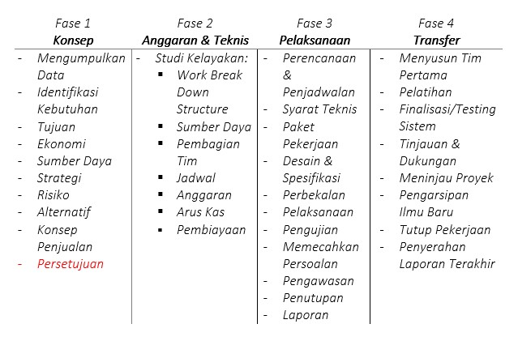
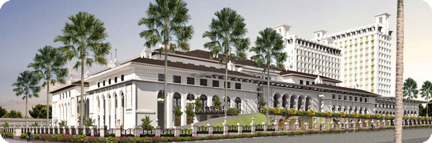
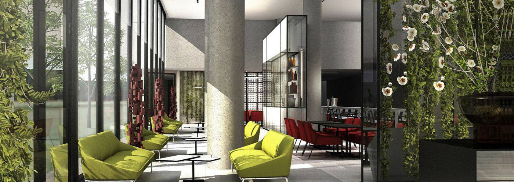
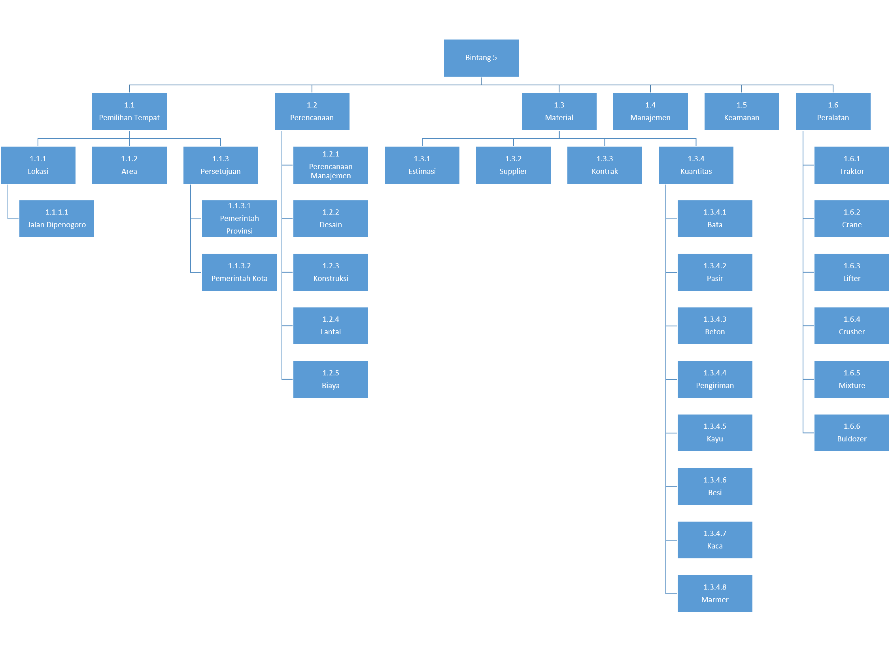
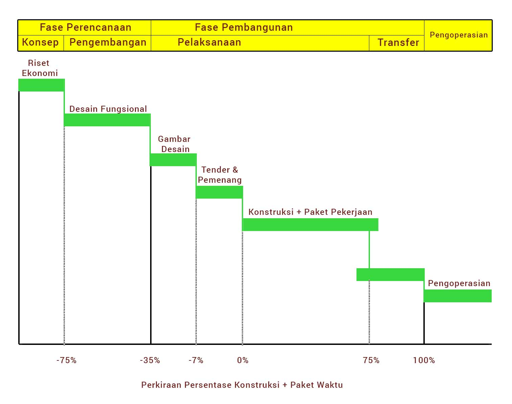
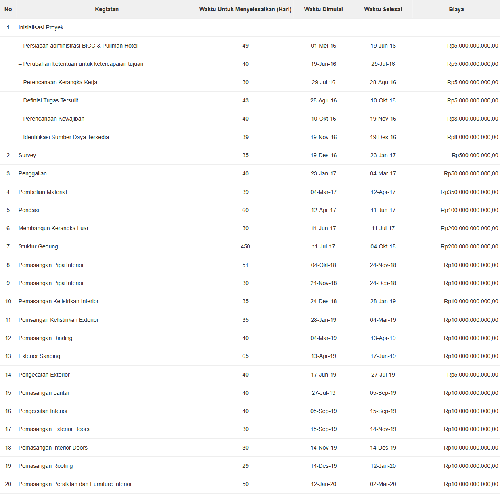

Menantang sekaligus menyenangkan adalah kesan dari mengerjakan tugas ini, karena ganjaran berupa bebas UTS dinilai cukup menggiurkan bagi diri seorang mahasiswa pemalas hehe.

Langsung saja kita menuju ke titik pembahasan tugas ini, merupakan mata kuliah manajemen proyek yang minggu sebelumnya membahas [kegagalan proyek di bidang teknologi informasi.](http://yukizr.com/penyebab-kegagalan-proyek-teknologi-informasi/)

Maka untuk sekarang kami diperintah untuk memantaskan diri lalu berpikir jikalau mempunyai proyek pembangunan hotel yang berada di depan gedung sate langkah terkait apa saja untuk membuat bidang kosong menjadi sebuah hotel yang mempunyai ciri tersendiri dengan konsepnya.

Sebenarnya kami tidak dilarang untuk merubah konsep hotelnya namun saya mempunyai pikiran tetap melanjutkan konsep yang sudah ada dengan penjelasan sudut pandang saya yang terbatas ini tentunya.

Oke sebelumnya saya jelaskan terlebih dahulu sebisa mungkin secara singkat serta padat siapa saja yang terkait dengan pembangunan hotel, dan tujuannya.

**Sejarah Pembangunan** 
 
Misteri mengapa di tengah kota terdapat danau yang ditutupi oleh seng akhirnya terjawab dengan adanya tugas ini, itu adalah pertanyaan yang diajukan sewaktu masih tingkat sekolah dasar kepada orang tua dan bisa terkuat berkat adanya tugas ini haha :D

Menurut beberapa artikel rencana pembangunan hotel dan convention centre telah ada sejak tahun 1997. Jadi Pada periode tersebut, pembangunan hotel dan convention centre telah mendapat izin mendirikan bangunan (IMB).

Namun sempat terhenti akibat krisis ekonomi pada masa itu. Akhirnya pada rencana tersebut dilanjutkan kembali oleh anak perusahaan Agung Podomoro Land, yakni PT Tritunggal Lestari Makmur (TLM) yang akan berinvestasi dengan nilai Rp 945 Miliar.

Sejalan dengan pemerintah kota mengidamkan adanya sebuah gedung yang berfungsi sebagai convention center yang akan satu lokasi dengan hotel.

Kerap nama proyek itu dinamai dengan Bandung International Convention Centre (BICC). Lokasi sarana dibangun di atas lahan seluas 18.000 m2 dan untuk hotelnya sendiri akan dibangun hotel dengan standar bintang lima yang memiliki fasilitas 14 lantai, dengan kapasitas 330 kamar dan dapat menampung 5.000 orang lebih.

Untuk pengelolannya akan diserahkan kepada grup Accor yang memakai brand Pullman Hotel. Diharapkan hotel dan convention centre dapat menjadi pusat kegiatan dan ikon baru di Kota Bandung.

Pengembangan bisnis MICE (Meeting, Intencives, Conference, and Exhibitions) masih sangat berpotensi tumbuh besar di Kota Bandung. Juga, kawasan ini dapat menjadi tujuan wisatawan domestik dan mancanegara.

PT TLM optimis dapat menggarap pasar hotel dengan okupansi sampai 70 serta menyasar segmentasi golongan menengah ke atas. Insya Allah hajat abi bade diditu engke mun tos jadi :p \*ngahayal

**Jika Aku Menjadi** 
 
Oke mode jika aku menjadi telah menyala maka saya akan meluruskan persepsi terlebih dahulu dengan sebuah dongeng, mengapa harus dongeng karena kita semua adalah seorang anak-anak yang terperangkap dalam tubuh dewasa \*ngaco

Alkisah PT Zain Rohman berencana membuat sebuah hotel dan balai pertemuan yang dapat menampung jamaah pengunjung 5.000 orang. Hotel akan terletak pada kawasan Gasibu, Jalan Dipenogoro - Kota Bandung.

Hotel akan dibangun di atas lahan seluas 18.000 m2, lalu memiliki 14 lantai serta 330 kamar dan standarnya sendiri adalah bintang lima.

Total investasi yang akan dikucurkan dalam proyek ini adalah Rp 1 Triliun yang diperoleh dari kas perusahaan 50% serta pinjaman perbankan berbasis Islam 50%.

Proyek ini diharapkan rampung dalam waktu 2 tahun, sehingga pada awal tahun 2019 diharapkan sudah beroperasi dan untuk pengelolaannya sendiri akan dipercayakan kepada patner perusahaan yaitu Accor Group dengan memakai brand Pullman.

**Empat Tahapan Dasar**

Namun tidak semua akan dipaparkan karena selain keterbatasan materi serta pengetahuan saya sendiri.

## Fase 1 - Konsep

### Tujuan Proyek
MICE (Meeting, Intencives, Conference, and Exhibitions) masih sangat berpotensi tumbuh besar di Kota Bandung. Juga, kawasan ini dapat menjadi tujuan wisatawan domestik dan mancanegara.

### Deskripsi Proyek
Sebagai hotel yang berstandarkan bintang lima maka elemen utamanya adalah, lokasi, jarak dari pusat keramaian, desain, kelas yang ditawarkan (ekonimis, VIP, VVIP) beberapa diantaranya. Karena berdampingan dengan Bandung International Convention Centre (BICC) lalu pemerintahan Jawa Barat maka fokus utama akan bertumpu pada pelayanan, keamanan, makanan, desain dan tema utamanya adalah "Make People Feel Luxurious".

### Identifikasi Kebutuhan Proyek
Proyek ini membutuhkan dana yang besar, karena berada pada jajaran hotel kelas mewah seperti Marriot, dan lain sebagainya. Untuk bersaing dengan mereka kita harus memberikan nilai lebih kepada para tamu dalam bentuk yang baik serta lokasi yang nyaman, menarik untuk dilihat yang bearti merujuk kepada desain dan menyewa arsitek yang mumpuni serta visioner, memasang teknologi terbaru untuk keamanan, dan lain-lain.

### Risiko 
Dokumentasi mengenai risiko perihal lokasi hotel, tim pengembang, desain aritektur, risiko mengenai pemasangan yang berbau teknologi seperti di mana membelinya, bagaimanan pemasangannya, serta menyewa konsultan yang ahli di bidangnya.

### Konsep Penjualan 
Menggunakan pengelolaan dari Grup Accor dengan brand Pullman, kami memilih brand Pullman karena brand internasional terbaik dari Accor Group, yang menargetkan para pelancong yang memiliki koneksi yang luas dan senang menggabungkan antara pekerjaan dengan pelesiran.

Berikut untuk gambarannya:

## Fase 2 - Anggaran & Teknis

### Work Breakdown Stucture

### Jadwal Proyek : Bar Chart

### Anggaran

*Deksripsi Teknis*

Proyek ini akan mengakomodasi fasilitas sebagai berikut:

- Gedung Bandung International Convention Centre (BICC)
    - 5000 tempat duduk
    - Lobby
    - Fasilitas Administrasi
- Pullman Hotel
    - 14 lantai
    - 330 kamar
    - Lobi, café, bar, dan fasilitas administrasi
    - Deluxe single dan Double Rooms
    - Bangunan Untuk Bagian Keamanan

Pekerjaan Infrastuktur, diantaranya:

- Kelistrikan
- Pengelolaan Limbah
- Perpipaan
- Genset

Area Proyek Hotel dibangun di jalan dipenogoro dengan muka menghadap ke lapangan gasibu.

Status Proyek / Timeline Fase konstruksi akan dimulai pada kuartal ke dua tahun 2016 dan memakan waktu kira-kira 2,5 tahun sehingga diharapkan pada awal tahun 2019 awal sudah siap untuk digunakan.

### Tugas & Tanggung Jawab

**Komite proyek:**

- Manajer konstruksi dan perwakilan dari pengguna yang terkena proyek (manajemen menengah atau lebih tinggi)
- Keanggotaan adalah sekitar 5 orang
- Menyetujui laporan awal analisis, laporan arsitektur, laporan pelaksanaan dan semua deliverable proyek lainnya
- Menyetujui rencana proyek dan rencana rilis evolusi proyek monitor melalui ulasan proyek reguler
- Pengguna tingkat manajemen yang paling prihatin langsung dengan sistem yang dikembangkan
- Laporan kepada komite proyek
- Menugaskan personel pengguna diperlukan untuk mendukung tim pengembangan dalam penyusunan spesifikasi fungsional dan pekerjaan lain
- Ulasan laporan analisis awal, laporan arsitektur dan laporan pelaksanaan.
- Menyetujui spesifikasi fungsional dan definisi elemen data dan proyek

**Proyek Manager:**

- Sangat dinamis dengan keterampilan manajemen yang baik
- Laporan kepada komite proyek
- Mengepalai tim pengembangan
- Membangun tim pengembangan
- Koordinat pengembangan, kegiatan, dan dapat berpartisipasi dalam beberapa dari mereka yaitu analisis awal
- Mempersiapkan rencana dan rilis rencana proyek dan menyerahkan kepada panitia proyek untuk persetujuan
- Menyetujui rencana kelompok
- Mempersiapkan ulasan proyek dan menyajikan mereka kepada komite proyek
- Melakukan review kemajuan dengan pemimpin kelompok
- Melakukan pertemuan perubahan manajemen
- Melakukan pertemuan berurusan dengan isu-isu yang beredar

**Tim Pengembang Firma Arsitek:**

- Bertanggung jawab untuk mengembangkan kiriman analisis awal
- Bertanggung jawab untuk mengembangkan dan memperbarui semua kiriman arsitektur
- Harus menentukan mandat dan memulai pekerjaan masing-masing kelompok pengembangan
- Menyediakan semua dukungan yang diperlukan oleh kelompok pengembangan
- Bertanggung jawab untuk meninjau beberapa kiriman pembangunan termasuk:
    - Unit proses spesifikasi fungsional
    - Optimasi dari segi desain

**Administrasi Database Kelompok:**

- Unit Administrasi bertanggung jawab untuk administrasi database tingkat perusahaan
- Menetapkan administrator database untuk proyek
- Bertanggung jawab untuk entri data fisik pemodelan kamus, untuk memastikan integritas dari semua data

**Operasi komputer Grup:**

- Unit Administrasi bertanggung jawab untuk operasi sistem organisasi komputer
- Berpartisipasi dalam arsitektur produksi (fase akhir)
- Co-koordinat penggunaan sumber daya pengolahan data untuk produksi dan pengembangan
- Membantu pengguna
