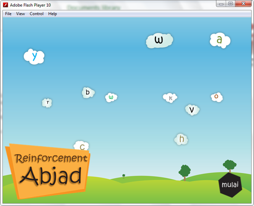
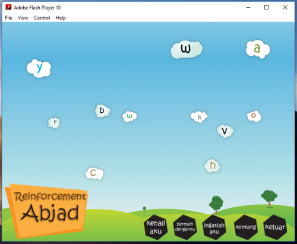

Ketika hari telah memasuki sekitar pukul 13.09 WIB. Seorang teman menghubungi untuk meminta bantuan untuk membuat sebuah media interaktif untuk anak yang kesulitan membaca.

Inilah saat yang tepat untuk mendekatinya. Diriku merasa tertantang dan juga penasaran untuk membuatnya. Kegiatan selanjutnya ialah mencari-cari bahan juga referensi yang ada sebagai inspirasi.

Ternyata jarang sekali dengan kriteria yang diinginkan, karena kalaupun ada itu harus berbayar ataupun berbasa inggris.

Dirasa telah cukup mengumpukan referensi maka dimulai pembuatan media interaktif tersebut. Selama bergelut sekitar 2 hari 3 malam akhirnya media interaktif sudah beres.

Namun memang masih banyak kekurangan karena memang waktu yang tersedia hanya 2 hari.

Ini adalah tampilan awalnya dari media interaktif tersebut

Bagi Anda yang membutuhkannya silahkan bisa diunduh [disini](https://drive.google.com/file/d/0B2ezX9UNQ0ltcGRPRkZxN01LR3M/view?usp=sharing "Reinforcement Abjad").
