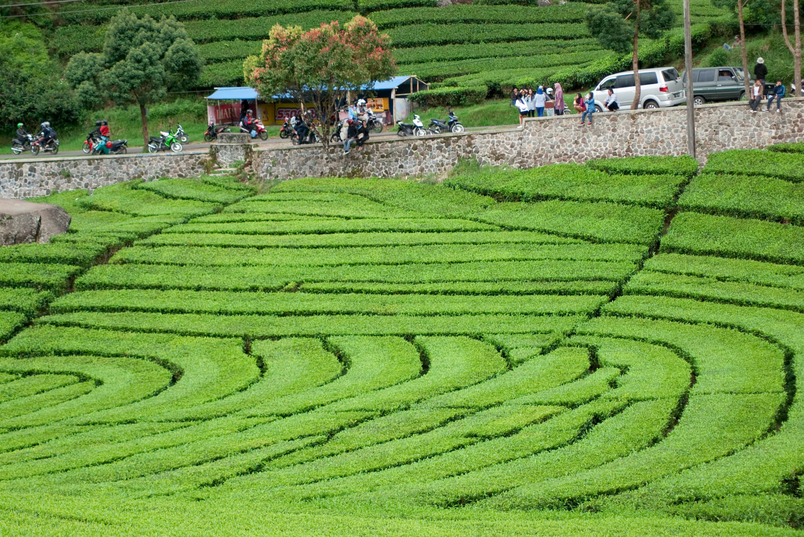
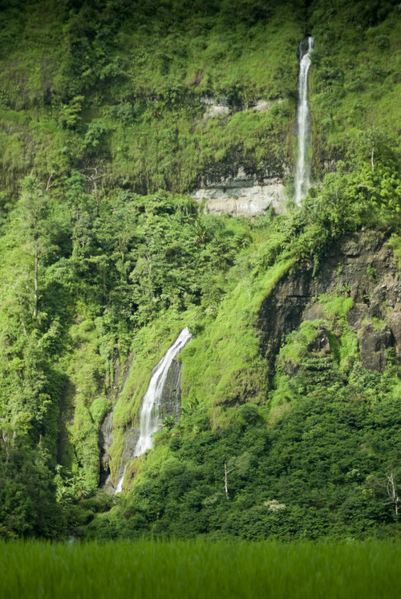
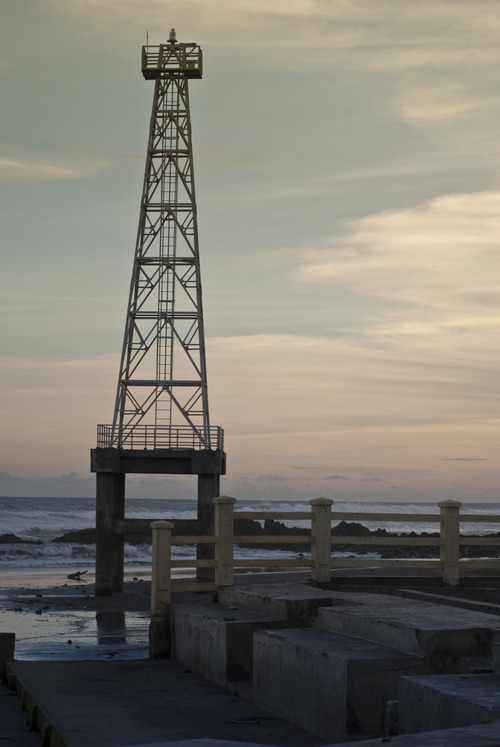
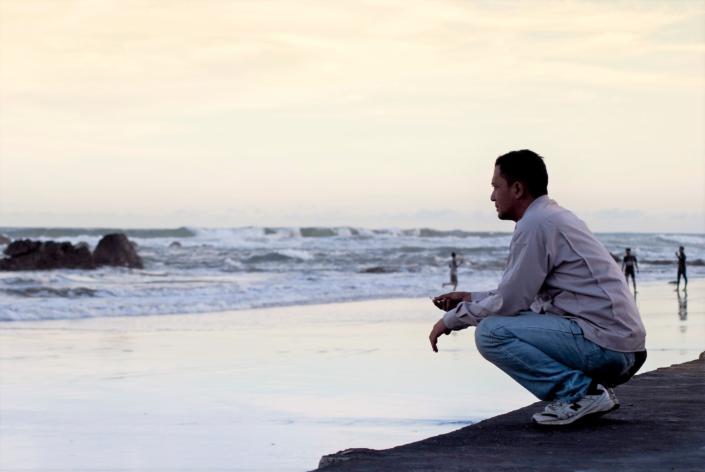

Perjalanan yang tak terduga tepatnya, karena tak pernah sedikit pun benak di pikiran untuk bisa mengujungi Pantai Cijayanti yang berada di daerah Cianjur Selatan.

Daerah Cianjur Selatan terkenal dengan jalanannya yang umumnya kita jumpai di pelosok. Mungkin untuk daerah Cidaun pernah mendengarnya mungkin ketika masih duduk di bangku Sekolah Dasar.

Hari Minggu, 9 Juni 2013 awal perjalanan hanya sebatas hingga Ciwalini-Ciwidey itupun karena ada pekerjaan mengambil foto awal pernikahan _(pre wedding)._

 
*Kebun Teh Ciwalini*

Namun karena masih banyak tersisa waktu karena kami beres mengambil gambar sekitar pukul 14.00 WIB.

Sehingga yang di benak kami yang bertiga adalah berusaha menghabiskan waktu dengan cepat.

Kami bertiga yakni penulis, Pa Dudi, Pa Cahyadi. Sebagai info keduanya adalah guru ku pada saat SMK.

Salah seorang guruku mengusulkan daerah Cidaun, tanpa pikir panjang kami langsung tancap gas menuju lokasi.

Bukan mengusulkan, lebih tepatnya adalah menjebaknya. Jebakan itu adalah awal mula cerita untuk tulisan ini serta perjalanan selanjutnya.

Ternyata sepanjang perjalan awal dari daerah Ciwalini kami disuguhi pemandangan yang ciamik dari atas bukit berupa hamparan kebun teh serta perbukitan yang begitu memanjakan mata.

Memang tak dapat dipungkiri lagi bahwa berwisata ke sebuah tempat bernuansa alam sungguh sangat menenangkan pikiran terutama bagi para penduduk kota besar.

Selanjutnya kami seperti di tengah-tengah negeri awan, namun di balik awan/kabut adalah jurang yang sangat dalam.

Untungnya cuaca hanya mendung tapi tak sampai turun hujan, hari itu sepertinya cuaca sangat berpihak sekali.

Sebelum tiba di Desa Lebak Gede kami berhenti sejenak karena tertegun melihat pemandangan yang begitu memukau hati dan pikiran  yaitu perpaduan yang berupa hamparan sawah hijau dan nampak jauh di depannya terdapat air terjun / _curug_ dalam Bahasa Sunda.

 
*Curug di Desa Lebak Gede*

Memang Indonesia terlebih tanah Parahyangan itu sangat kaya akan pemandangan alamnya yang begitu cantik nan elok, sungguh beruntung sekali sekali saya terlahir di negeri ini.

Perjalanan dilanjutkan kembali, sampai tiba akhirnya kami menemui jalan yang mulai rusak selepas melewati desa naringgul. Sebenarnya perjalanan bisa lebih cepat andaikan jalanan tidak rusak namun kenyataannya berkata lain.

Disarankan untuk tidak seorang diri pergi ke Pantai Cijayanti, Cidaun karena mengingat medan yang cukup berat juga sebagai antisipasi apabila kendaraan Anda bermasalah, kecuali apabila Anda seorang petualang sejati.

Namun kurang lebih 11 km menuju Cidaun jalanan mulai agak bersahabat kembali, sehingga Anda bisa kembali memacu kendaraan Anda lebih cepat.

Akhirnya selama kurang lebih 2,5 jam perjalanan dari Ciwalini-Ciwidey, kami pun tiba di Pantai Cijayanti yang disaat itu telah mulai disergap oleh senja.

Maka tidak ada yang lain dilakukan selain dengan mengabadikan momen tersebut dengan kamera.

  
*Mercusuar Pantai Jayanti*

 
*Kontemplasi di Tepi Pantai Cijayanti*