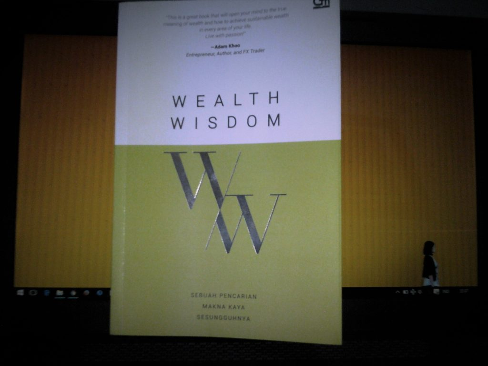
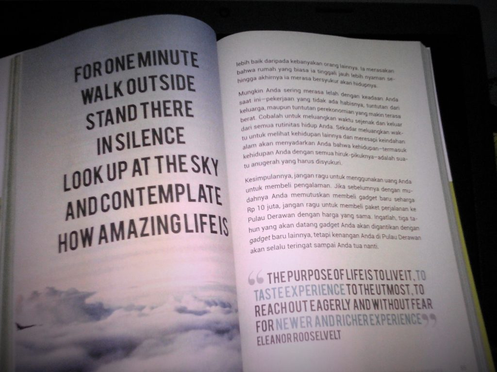

Apakah memiliki materi yang berlebih akan membuat diri kita bahagia?

Ya jika kita bisa membeli kebahagiaan bilamana kita membeli sejumlah hal yang tepat seperti membeli sebuah pengalaman ataupun berbagi dengan orang lain.

Itu adalah salah satu hal yang dibahas dalam buku yang disusun oleh tim Wealth Wisdom Permata Bank. Dengan slogannya "Sebuah Pencarian Makna Kaya Sesungguhnya" kita akan dibawa untuk mengetahui arti sebenarnya tentang kekayaan. Terbagi menjadi tujuh chapter serta sebuah epilogue yaitu:

- Chapter 1 : Are You Really Wealthy?
- Chapter 2 : #SayangUangnya
- Chapter 3 : Can Money Buy You Happiness?
- Chapter 4 : Have You Passed on Wealth Wisdom to Your Children?
- Chapter 5 : Have You Treasured Your Health?
- Chapter 6 : Have You Lived a Wealthy Life?
- Chapter 7 : Wealth Wisdom Framework
- Epilogue : Wealth Wisdom Reflective Questions

Buku ini sangat mudah dicerna karena disusun dengan bahasa yang mudah dipahami, serta menggunakan desain yang ciamik.

Membuat kita semangat dalam melahap setiap halamannya. Juga ada beberapa kutipan-kutipan dari para pesohor seperti Dalai Lama, Bill Gates, Hellen Keller, dan Bunda Theresa.

Bagi saya pribadi buku ini memberikan wawasan perihal manajemen keuangan pribadi,  serta perbedaan antara pendapatan dan kecukupan finansial.

Juga tentang pentingnya menurunkan kebijaksanaan (wisdom) kepada anak-anak Anda, cara mengatur uang untuk anak-anak, dan mengajarkannya bahwa kekayaan sebenarnya tidak hanya diukur dari segi materi saja.

 
_Cover Buku Wealth Wisdom_

_Kutipan Dalam Buku Wealth Wisdom_

Buku ini membagi kekayaan yang sesungguhnya menjadi lima aspek (dikutip dari dari halaman 180), yaitu:

1. Kemampuan finansial: bagaimana menggunakan uang secara bijaksana
2. Kemampuan untuk menggunakan uang agar membawa kebahagiaan yang sesungguhnya
3. Hubungan yang baik dengan keluarga
4. Kesehatan baik tubuh maupun jiwa
5. Kemampuan untuk menemukan tujuan hidup yang sesungguhnya dan menjalani tujuan tersebut

_"What Money Can Buy? Computer but not Brain, A House but no a Home, Obedience but not Faithfulness, Food but not Appetite, Companion but not Love". - Anonymous_

Thanks to Oda for introducing this book :D
