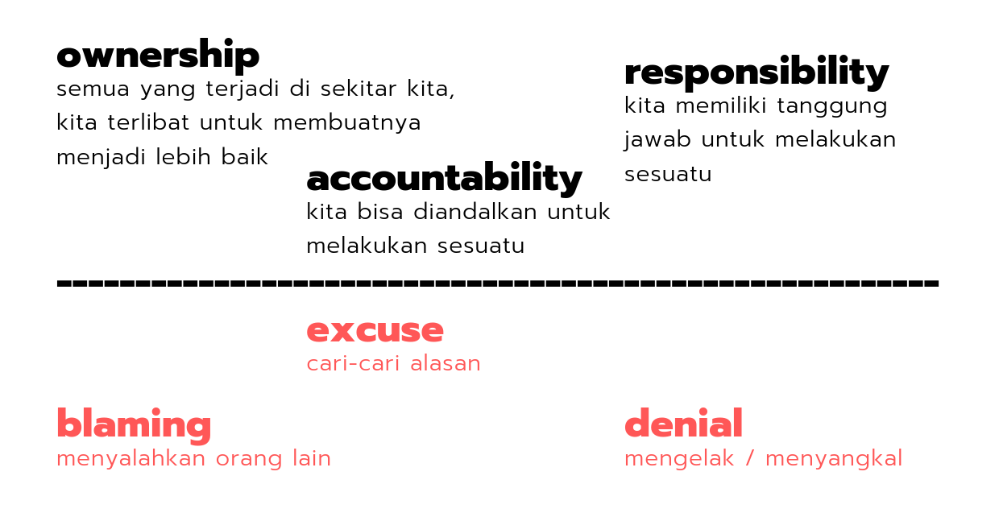

Pada hari selasa, 7 mei 2013 saya mendapatkan kesempatan mengikuti sebuah seminar berbasis telematika yang diselenggerakan oleh Dinas Koperasi UMKM Perindustrian Perdagangan Dan Pertanian Kota Cimahi.

Seminar diadakan di sebuah restoran yang berada di kaki perbukitan menuju arah lembang atau tepatnya di Alam Wisata Cimahi.

Dihadiri oleh para siswa ataupun alumni dari berbagai SMK, SMA, bahkan perguruan tinggi ternama di Kota Bandung dan Cimahi seperti ITB, UNPAD, UPI, UNPAR,  Maranatha, & UNJANI.

Pembicara pada sesi 1 adalah Budi Rahardjo dari ITB, latar belakang beliau adalah seorang dosen, _blogger_, _entrepreneur_, pemain musik beraliran _progressive rock_.

Beliau membawakan seminar dengan cara penuh humoris sehingga tak ayal, para peserta maupun panitia tertawa dengan terbahak-bahak.

Disini beliau memaparkan perihal berwirausaha dari sudut pandang ataupun dari pengalamannya, seperti usaha membuat alat bantu bedah untuk dokter,  menjalankan Internet Service Provider.

Hingga secara sekaligus membuat 10 perusahaan IT yang berbeda lalu hingga kini hanya tersisa 2 perusahaan saja yang masih bertahan.

Menurutnya untuk mengawali terjun di dunia bisnis IT kita hanya butuh ide serta _creativity_, tak bisa dipungkiri bahwa kreatif adalah hal yang wajib tetapi tidak hanya berlaku bagi seseorang yang terjun di dalam bidang IT.

Biasanya para pelaku yang akan terjun di dunia IT langkah pertama yang dilakukannya adalah memecahkan masalah yang beredar di masyarakat dengan bantuan ilmu informatika.

Menemukan masalah lalu memecahkannya, mungkin terlihat mudah tetapi kadang kemudahan yang kita berikan kepada masyarakat melalui IT tidak terlalu diperhatikan oleh masyarakat itu sendiri karena berbagai faktor. Seperti kebiasaan, ataupun kesulitan saat menggunakan peralatan IT.

Nah, disini pak budi rahardjo memberikan sebuah kalimat yang menurut saya sangat penting sekali bagi para orang-orang yang berkutat di dunia IT.

Sehebat-hebatnya dunia IT itu melangkah maju, namun tetap saya bahwa Ilmu Informatika yang berada dibalik dunia IT.

Karena IT adalah sebuah alat dari Ilmu Sosial, jadi disarankan juga orang-orang IT untuk mempelajari mengenai Ilmu Sosial.

Karena pada dasarnya manusia adalah makluk sosial, dan berhubungan dengan orang lain itu adalah kebutuhannya. Jadi bila kita ingin memecahkan masalah sosial yang ada dengan IT maka kita harus sedikitnya mempelajarinya dari Ilmu Sosial.

Agar masalah yang kita pecahkan benar-benar sesuai dengan yang beredar di masyarakat. Ada sebuah kutipan yang beliau kutip juga dari orang lain tentang berbisnis yaitu kurang lebihnya seperti ini _“ Membuat usaha itu seperti halnya merawat seorang anak, tak ada kata mundur, harus membesarkannya sampai sukses “_.

Selain tentang berwirausaha beliau adalah seorang _blogger_, bahkan blog beliau [http://rahard.wordpress.com](http://rahard.wordpress.com/) mendapatkan ranking ke-3 sebagai blog yang paling banyak dikunjungi di Indonesia.

Karena dalam setiap hari beliau _posting_ tulisan. Saran beliau untuk para _blogger_ pemula adalah lakukan karya yang sama seperti contohnya menulis sebanyak 10.000x maka Anda akan jadi _expert_ di bidang tersebut.

Lalu pembicara pada sesi ke-2 adalah Arief Widhiyasa, CEO dan _founder_ Agate Studio. Kang Arief ini berkutat di seputar bisnis _games_, baik untuk _platform_ _mobile, web, & console._

Menurutnya Agate Studio dibangun dari kegilaannya bermain _games_ bersama teman-teman kuliahnya. Kang Arief bersama dengan Agate Studio telah mengalami pasang surut.

Namun hal yang penting bagi mereka adalah ketika perusahaan di masa benar-benar surut atau akan bangkrut mereka mempunyai sikap pantang menyerah ala _gamers_ pada umumnya lalu selalu berpikir optimis & positif.

Ada sebuah cerita dari _mentor_ beliau bagaimana cara berpikir yang positif dapat menentukan kita ke masa yang akan datang.

Cerita ini disadur dari http://startupbisnis.com/hal-terpenting-yang-dipelajari-oleh-agatestudio-dari-mentor-mereka/.

Di dunia ini kita dipisahkan oleh sebuah garis. Ada orang yang di atas garis dan ada orang yang di bawah garis.

Orang-orang yang di bawah garis akan melakukan _blame, excuse_ atau _denial_. Misalnya orang datang telat ke kantor, ia ditanyakan oleh bosnya “_kenapa kamu telat?_”

Ia akan mulai _blaming_ / menyalahkan orang lain “_anak saya rewel_” … “_istri saya telat bangunin_” atau _excuse “kena macet di tol Cawang_” – padahal tol Cawang memang tiap hari macet.

_Excuse_ ini cari-cari alasan yang tidak penting, yang lebih parah _“denial”_ … “_ah enggak ah, tidak telat kok!_” dia mengelak mengakui kalau dia telat.

Sedangkan orang-orang yang ada di atas memiliki _ownership_, artinya semua yang terjadi di sekitar kita, kita terlibat untuk membuatnya menjadi lebih baik.

Sedangkan _accountability_ artinya kita bisa diandalkan untuk melakukan sesuatu, _responsibility_ artinya kita memiliki tanggung jawab untuk melakukan sesuatu.

**Kopi Tumpah** Cerita kopi tumpah memiliki latar sebuah keluarga kecil, bapak, ibu dan seorang anak perempuan masih SD.

Suatu pagi si anak mau berangkat sekolah, si ayah mau berangkat, ibunya mau buatkan kopi, lalu si ibu menempatkan kopi di meja tempat si bapak duduk, si ibu menempatkan kopi agak ke pinggir meja.

Si anak hari itu akan menghadapi ulangan, dia semangat sekali karena sudah persiapan beberapa hari sebelumnya.

Si anak yakin pasti bisa, turun tangga semangat sekali  ”_papa..papa..nanti ulangan.._ ” … PRAKK .. kena kopi, kopinya tumpah … tumpah ke paha si bapak.

Apa yang dilakukan bapaknya ? Kita simulasikan bapak yang di bawah garis : Lagi duduk, kena kopi, PRAKK … Anaknya di maki-maki “_Kamu ini ceroboh banget ! jalan aja gak bener !_”

Istrinya datang, di maki lagi sama si bapak “_Kamu ini juga kenapa taruh kopi di pinggir banget !” … “Ya udah saya ganti celana dulu di atas_”.

Waktu si bapak ke lantai atas, yang jemput anaknya datang “_TINN TINN .. Jemputan !!!_“.

Si ibu bilang “aduh pak, ini anaknya lagi nangis… nanti ya saya antar sendiri” Si bapak tak lama kemudian turun lagi, lihat anaknya masih nangis “_lho kok dia belum sekolah ???_”

_“Loh kan tadi gara-gara kamu dia jadi nangis ??”_ Mulai deh perang dunia ke-2 … cek cok lagi. _“Ya udah saya antar”_ .. bapaknya ngalah. … Dalam perjalanan ke sekolah semuanya serba salah .. lampu merah disalahin, macet disalahin … anaknya masih nangis di mobil _“kamu ini nangis-nangis aja!”_.

Tak lama kemudian, si anak sampai di sekolah telat, si bapak juga telat, bosnya nanya “_kok kamu telat?_” .. marah-marah lagi “_kamu tidak tahu apa yang terjadi pada saya .. !”_

Nah sampai di situ ceritanya, kalau kita lihat dari cerita ini, hanya karena kopi tumpah tadi dan apa respon si bapak itu bisa mengubah masa depan dengan signifikan :

Hubungan si bapak dan istrinya menjadi tidak baik

-  Bapaknya bisa saja dipecat dari kantor karena tidak sopan
-  Yang lebih parah si anak, dia sudah belajar gila-gilaan, karena kopi tumpah tadi dia tidak konsen ujian,  terlambat sampai sekolah lagi.

Sekarang kita lihat, perbandingannya dengan orang yang ada di atas garis : Lagi duduk, kena kopi, PRAKK … _“Aaah panas-panas .. kamu sih semangat banget ! karena kamu semangat kamu harus ganti celana papa !”_

_“Gimana cara ganti celana papa ?”_ _”Yang penting kamu ulangan dapet 100 aja deh !”_ _“Oh iya iya.. aku pasti dapet 100″_

Artinya si bapak merasa ada ownership terhadap kejadian ini, kalau dia tidak duduk di situ kan dia tidak kena tumpahan kopi.

_“Mama-mama, buatin kopi lagi dong, kopi yang penuh cinta”_ Mamanya jadi senang.

Bayangkan dengan awal seperti ini, harinya berubah total. Dari semua orang-orang berhasil yang saya temukan, mereka ada di atas.

Jadi kita semua harus cepat-cepat pindah ke atas.
